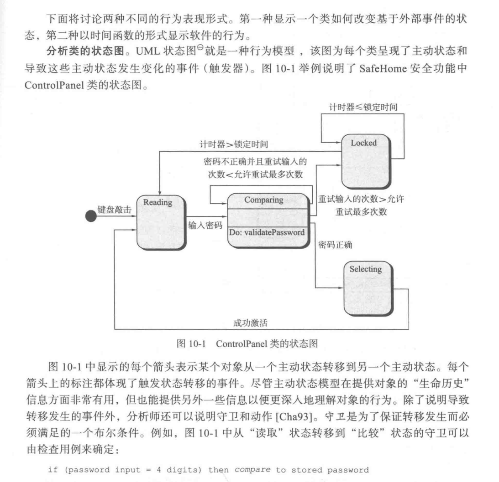
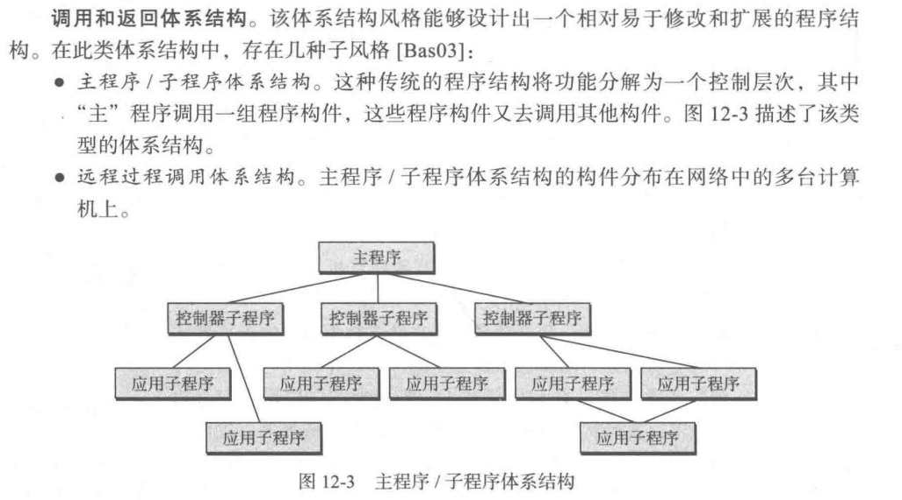
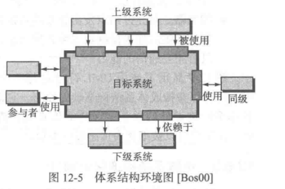
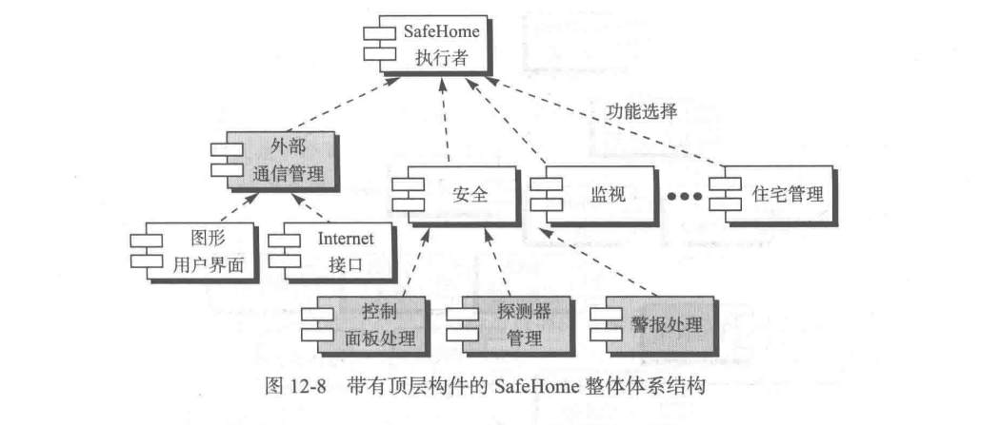
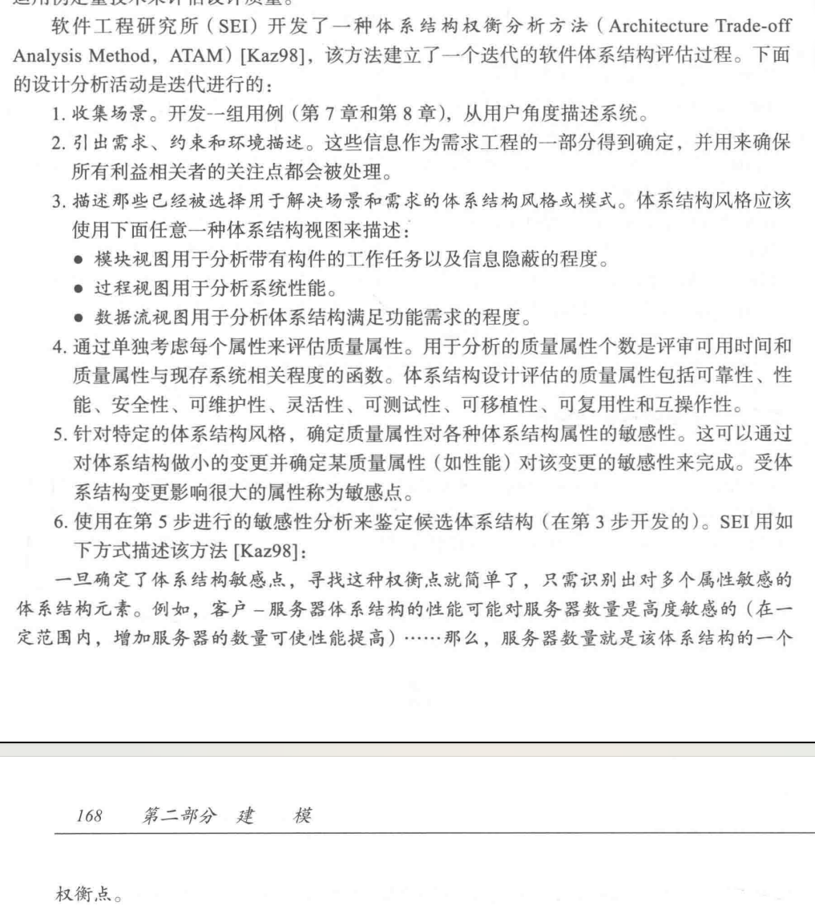

# 软件工程考点整理

本笔记由**脑袋空空先生**制作完成

**参考教材：**Software Engineering: A Practitioner's Approach (Eighth Edition)

**主要内容：**同济大学软件学院软件工程期末复习要点，包括软件过程与软件建模两个核心部分，内容为教材一到十四章的要点，涵盖杜庆峰老师及黄杰老师2023年秋季学期最后一堂课所标注重点的**全部内容**以及个人阅读教材后自认为重点的部分。

**更新内容：**补充英文注释以及相关题型案例分析。

# Chapter 0 前言

### 1.考试题型总结（2023年秋）

### 2. 杜庆峰老师最后一堂课所提重点内容

**本部分为杜庆峰老师PPT内容、与书本不完全对应**

> 1.2.3 云计算
>
> 2.1定义学科
>
> 2.2软件工程过程
>
> 2.3软件工程实践
>
> 2.4软件工程神话
>
> 3.1通用过程模型
>
> 3.2定义框架活动
>
> 3.3明确任务集
>
> 3.4过程模式
>
> 4.1惯用过程模型
>
> 5.1什么是敏捷
>
> 5.2敏捷变更及成本
>
> 5.4极限编程
>
> 5.5.1Scrum
>
> 7.1指导实践的原则
>
> 7.2
>
> 7.3
>
> 7.4
>
> 8.1需求工程
>
> 9基于场景的建模
>
> 10基于类的建模
>
> 11 11.1（图是改过的）
>
> 11.5.3 
>
> 12.1设计概念
>
> 12all
>
> 13.1软件体系结构
>
> 13.2软件体系类型
>
> 13.6体系结构设计
>
> 14.1什么是构件
>
> 14.3实施构件级设计

# Chapter 1 软件的本质The Nature of Software

## 1.1 软件的本质

**软件作用：**软件既是一种产品，也是交付产品的一个载体

**时代最重要产品：**信息 **Information**

**error 与 failure ：**error 交付之前——>failure 交付之后运行的结果不符合顾客的需求，failure可能由一个或多个error导致

**错误检查的技术**： **review technology** 评审技术； **testing technology** 测试技术

**开发问题：**开发时间、开发成本、开发错误检查、维护时间投入、开发进度度量

### 1.1.1 软件定义

**软件定义：**软件是:(1)**指令的集合instruction** (计算机程序)，通过执行这些指令可以满足预期的特性、功能和性能需求;(2**) 数据结构data structure**，使得程序可以合理利用信息;(3)**软件描述信息documentation**，它以硬拷贝和虚拟形式存在，用来描述程序的操作和使用。

**定义总结：**程序、数据、描述信息（文档）

**硬件失效率：**失效率是时间的函数。这个名为“浴缸曲线”的关系图显示:硬件在早期具有相对较高的失效率(这种失效通常来自设计或生产缺陷);在缺陷被逐个纠正之后，失效率随之降低并在-段时间内保持平稳(理想情况下很低);然而，随着时间推移，因为灰尘振动、不当使用、温度超限以及其他环境问题所造成的硬件组件损耗累积的效果，使得失效率再次抬高。简而言之，硬件开始**磨损**了。**Wear vs. Deterioration**

**软件失效“理想曲线”：**未知的缺陷将在程序生命周期的前期造成高失效率。然而随着错误的纠正，曲线将如图中所示趋于平缓。“理想曲线”只是软件实际失效模型的粗略简化。曲线的含义很明显一一软件不会磨损，但是软件退化的确存在。

**软件失效”实际曲线“：**软件将会面临变更，每次变更都可能引入新的错误，使得失效率像“实际曲线”那样陡然上升。在曲线回到最初的稳定失效率状态前，新的变更会引起曲线又一次上升。

**软件退化根本原因：**不断地变更

**软硬件区别：**磨损的硬件部件可以用备用部件替换，而软件却不存在备用部件。每个软件的缺陷都暗示了设计的缺陷或者在从设计转化到机器可执行代码的过程中产生的错误。因此，软件维护要应对变更请求，比硬件维护更为复杂。

### 1.1.2 软件应用领域

**系统软件System software**：操作系统、设备驱动程序

**应用软件Application software.**：办公软件office

工程/**科学软件Engineering/Scientific software**：matlab

**嵌入式软件Embedded software**：汽车内嵌软件、智能家居

**产品线软件Product-line software**：银行服务软件、手机操作系统（不同版本安卓）、零售POS系统

Web/移动**AppWeb/Mobile applications**：略

**人工智能软件Artificial intelligence software**：TensorFlow、OpenAI GPT

### 1.1.3 遗留软件Legacy Software

**定义：**年代久远的旧的系统

**特点：**老旧、质量差、生命周期长、业务关键性

**问题：**设计难以拓展，代码可读性差，文档混乱、测试用例和结果混乱、变更管理混乱

**需要演化原因：**

①A软件需要进行适应性调整，从而可以满足新的计算环境或者技术的需求。**adapted**
②U软件必须升级以实现新的商业需求.  **enhanced**
③E软件必须扩展以使之具有与更多新的系统和数据库的互操作能力。**extended**
④A软件架构必须进行改建以使之能适应不断演化的计算环境。（例如下面以前没有mobile，或部 署微服务框架等) **re-architected**

## 1.2 软件变更本质

**四大类软件：**WebApp、移动App、云计算、产品线软件

**云计算：**云计算包括基础设施或“生态系统”，它能使得任何用户在任何地点都可以使用计算设备来共享广泛的计算资源。

计算设备位于云的外部、可以访问云内各种资源。

资源包括应用软件、平台、基础设施。

云计算的实现需要开发包含前端和后端服务的体系结构。前端包括客户(用户)设备和应用软件(如浏览器)，用于访问后端。**Frontend services include the client devices and** **application software to allow access**.后端包括服务器和相关的计算资源、数据存储系统(如数据库)、服务器驻留应用程序和管理服务器。**Backend services include servers, data storage, and server-resident applications.**通过建立对云及其驻留资源的一系列访问协议，管理服务器使用中间件对流量进行协调和监控。

逻辑结构

——外部
计算设备

——内部资源

应用软件：监控、内容、协作、通信、财务

平台：对象存储、身份、运行时、队列、数据库

基础设施：计算、块存储、网络

（X）**产品线软件：**一系列软件密集型系统，可以共享一组公共的可管理的特性，这些特性可以满足特定市场或任务的特定需求，并以预定的方法从一组公共的核心资源开发出来。

软件产品线共享一组资源，包括需求(第7章)、体系结构(第12章)可重用构件(第13章)、测试用例(第17、18 章)及其他的软件工程工作产品。

# Chapter 2 软件工程Software Engineering

**开发软件前必须明确的事实：**

①确定方案前，需要共同努力明确问题 understand problem

②设计成为关键性活动 design

③设计方案需要有高质量 high quality

④软件必须可维护 maintainable

## 2.1 定义软件工程学科

**IEEE定义：**(1)将系统化的systematic、规范的disciplined、可量化quantifiable的方法应用于软件的开发、运行和维护，即将工程化方法应用于软件; (2)对(1)中所述方法的研究。

**可量化例子：**(定量了解项目的开发情况）三个人公司实习，把设计转为代码，系统对你们代码量测试，发现每一个人千行代码平均错误为20、10、5个，这就是通过软件工程思想进行可量化管理。

**软件工程层次图：**软件工程是一种层次化技术（自下而上）质量关注点、过程、方法、工具

**质量关注点a quality focus：**支持软件工程的根基。

**过程process：**软件工程的基础，定义了一个框架，软件过程将各个技术层次结合在一起，使得合理、及时地开发计算机软件成为可能。（回答了如何解决提高质量的问题）

**方法method：**为构建软件提供技术上的解决方法(如何做)，依赖基本原则，涵盖所有技术领域，方法贯穿于过程中，例如用例建模，数据库设计方法，架构方法，分析方法，设计方法，测试方法等多种方法。

**工具tool：**为过程和方法提供自动化或半自动化的支持。这些工具可以集成起来，使得一个工具产生的信息可被另外一个工具使用,这样就建立了软件开发的支撑系统，称为计算机辅助软件工程。

## 2.2 软件过程（重要）

**软件过程：**是工作产品构建时所执行的一系列**活动activities、动作actions和任务tasks**的集合。

**活动(activity)：**主要实现宽泛的目标(如与利益相关者进行沟通)，与应用领域、项目大小、结果复杂性或者实施软件工程的重要程度没有直接关系。

**动作(action，如体系结构设计)：**包含了主要工作产品(如体系结构设计模型)生产过程中的一系列任务。

**任务(task)：**关注小而明确的目标能够产生实际产品(如构建一个单元测试)。

### 2.2.1 过程框架

**过程框架(process framework)：**定义了若干个框架活动(frameworkactivity)，为实现完整的软件工程过程建立了基础。

**普适性活动(umbrella activity)：**过程框架包含的适用于整个软件过程的普适性活动。

**通用软件工程过程框架a generic process framework：沟通**（需求收集）、**策划**（大的，阶段的计划，技术任务，肯能风险，资源需求，工作产品，计划等）、**建模**（包括分析建模(Analysis modeling)，概要设计(high-level design)， component design 组件设计(detailed design),概要设计(high-level design)）、**构建**（coding & testing 写代码&测试,测试包括单元测试，系统测试）、**部署deployment**（delivery & maintenance & feedback 交付，维护，反馈）

软件开发过程包括很多迭代iteratively，并不是线性顺序的模型，而是循环往复。

**Stakeholders利益相关者**

### 2.2.2 普适性活动umbrella activities

软件过程框架活动由很多普适性的活动来补充实现。

**典型普适性活动：**

软件项目的跟踪和控制Software project tracking and control、

风险管理Risk management、

软件质量保证Software quality assurance、

技术评审Technical reviews、

测量Measurement、

软件配置管理Software configuration management、

可复用管理Reusability management、

工作产品的准备与生产Work product preparation and production

### 2.2.3 过程的适应性调整

**不同项目过程的主要区别体现：**

活动、动作和任务的总体流程以及相互依赖关系。Overall flow of activities, actions, and tasks and the interdependencies among them

在每一个框架活动中，动作和任务细化的程度。

工作产品的定义和要求的程度。

质量保证活动应用的方式

项目跟踪和控制活动应用的方式

过程描述的详细程度和严谨程度

客户和利益相关者对项目的参与程度

软件团队所赋予的自主权

队伍组织和角色的明确程度

## 2.3 软件工程实践

### 2.3.1 实践的精髓The Essence of Practice

①理解问题（沟通和分析）Understand the problem (communication and analysis).

②策划解决方案（建模和软件设计）.Plan a solution (modeling and software design).

③实施计划（代码生成）Carry out the plan (code generation).

④检查结果的正确性（测试和质量保证）Examine the result for accuracy (testing and 

quality assurance).

### 2.3.2 通用原则

**7个关注软件工程整体实践的原则：**

1. **存在价值The Reason It All Exists.**—— 系统因为能为用户提供价值而具有价值，项目的价值是什么，能不能带来生成效益
2. **保持简洁 KISS (Keep It Simple, Stupid!).**—— 架构简单清晰明了，设计尽可能简洁但不是过于简化
3. **保持愿景 Maintain the Vision.**—— 清晰的愿景是软件项目成功的基础。保证系统实现与愿景保持一致，对项目成功至关重要。
4. **关注使用者What You Produce, Others Will Consume**——在需求说明、设计和实现过程中，牢记要让别人理解你所做的事情。（用户，维护代码人员）
5. **面向未来 Be Open to the Future.**——生命周期持久的系统有更高的价值
6. **提前计划复用 Plan Ahead for Reuse——**代码尽量标准化，提前考虑组件复用性前瞻性，降低成本
7. **认真思考Think**——行动定位清晰、完整思考能有更好的结果

## 2.4 软件神话（误区）

管理者神话、客户神话、从业者神话

## 2.5 如何开始

每个软件工程项目都来自**业务需求**一一对现有应用程序缺陷的纠正，改变遗留系统以适应新的业务环境，扩展现有应用程序功能和特性，或者开发某种新的产品、服务或系统。在软件项目的初期，业务需求通常是在简短的谈话过程中非正式地表达出来的。

# Chapter 3 软件过程Software Process

## 3.1 通用过程模型

**过程定义：**为在工作产品构建过程中所需完成的工作活动、动作和任务的集合。这些活动、动作、任务中的每一个都隶属于某一框架或者模型，框架或模型定义了它们与过程之间或者相互之间的关系。

**关键点：** 在软件过程中，技术工作的层次包括活动，活动由动作构成，动作由任务构成。

**软件过程框架示意图：**每个框架活动由一系列软件工程动作构成。每个软件工程动作由任务集来定义，这个任务集明确了将要完成的工作任务、将要产生的工作产品、所需要的质量保证点以及用于表明过程状态的里程碑。

软件工程的通用过程框架定义了五种框架活动一沟通、策划、建模、构建以及部署。此外，一系列普适性活动一一项目跟踪控制、风险管理、质量保划、证、配置管理、技术评审以及其他活动——贯穿软件过程始终。

**过程流：**描述了在执行顺序和执行时间上如何组织框架中的活动、动作和任务。

**线性过程流(linear process flow)**从沟通到部署顺序执行五个框架活动。

**选代过程流(iterative process flow)**在执行下一个活动前重复执行之前的一个或多个活动。

**演化过程流(evolutionary process flow)**采用循环的方式执行各个活动，每次循环都能产生更为完善的软件版本。

**并行过程流(parallel process flow)**将一个或多个活动与其他活动并行执行(例如，软件一个方面的建模可以同软件另一个方面的构建活动并行执行)。

## 3.2 定义软件框架活动

**关键点：**不同的项目需要不同的任务集。软件团队根据问题和项目的特点选择任务集。

例子： 活动（沟通）、动作（起始、需求获取、需求细化、协商、规格说明和确认）、任务集（协商举例：1.通过电话与利益相关者取得联系  2.讨论需求并做记录  3.将笔记整理成一份简单的书面需求  4.通过E-mai请利益相关者审阅并认可）

## 3.3 明确任务集

软件工程动作可以根据软件项目的特定需要和项目团队的特点做适当的调整。

## 3.4过程模式

**过程模式(process pattern)：**描述了软件工程工作中遇到的过程相关的问题，明确了问题环境并给出了针对该问题的一种或几种可证明的解决方案。通俗地讲，过程模式提供了一个模板--一种在软件过程的背景下统一描述问题解决方案的方法。通过模式组合，软件团队可以解决问题并定义最符合项目需求的开发过程。

**关键点:**模式模板提供了描述模式的一般性方法。

**模板：**模式名称、驱动力、类型（步骤模式，任务模式，阶段模式）、启动条件、问题、解决方案、结果、相关模式、已有应用和实例。

**步骤模式(stage pattern)**——定义了与过程的框架活动相关的问题由于框架活动包括很多动作和工作任务，因此步骤模式包括与步骤(框架活动)有关的许多任务模式(见以下描述)。例如，建立沟通可能作为一个步骤模式，该步骤模式可能包括需求收集等任务模式。

**任务模式(task pattern)**——定义了与软件工程动作或是工作任务相关、关系软件工程实践成败的问题(例如，需求收集是一个任务模式)。

**阶段模式(phase patter)**——定义在过程中发生的框架活动序列，即使这些活动流本质上是迭代的。例如，螺旋模型和原型开发就可能是两种阶段模式。

# Chapter 4 过程模型Process Models

**关键概念：**面向方面的软件开发、基于构件的开发、并发模型、演化过程模型、形式化方法模型、增量过程模型、过程建模工具、原型开发、螺旋模型、统一过程、V模型、瀑布模型

**过程模型的作用：**减少开发新软件产品时出现的混乱。

## 4.1 惯用过程模型（重点）Prescriptive Models

**惯用过程模型**力求达到软件开发的结构和秩序，其活动和任务都是按照过程的特定指引顺序进行的。

**注意点：**所有的软件过程模型都支持第2章和第3章中描述的通用框架活动，但是每一个模型都对框架活动有不同的侧重，并且定义了不同的过程流以不同的方式执行每一个框架活动(以及软件工程动作和任务)。

### 4.1.1 瀑布模型

**瀑布模型(waterfallmodel)**又称为经典生命周期(classic life cycle)，它提出了一个系统的、顺序的软件开发方法，从用户需求规格说明开始，通过策划、建模、构建和部署的过程，最终提供完整的软件支持。

**特点：**①顺序开发、很少迭代 ②过程明确，需求清晰 ③不主张迭代，但也有迭代 ④用户需要很长时间才能得到成品 ⑤某阶段受阻，整个项目都会到限制 ⑥线性模型 ⑦项目大的时候不建议使用，适合需求清晰稳定的情况。

**缺点与问题：**①实际项目很少遵循模型提出的顺序流程②客户通常很难明确地陈述所有要求  ③  客户要有耐心，程序的工作版本要到项目时间跨度的后期才可用。

### 4.1.1 （extend）V-模型

瀑布模型的变种，描述了质量保证行动与与沟通、建模和早期建设活动相关的行动之间的关系。

**关键点：**V模型阐明了验证和确认动作如何与早期工程动作相互关联。

**过程：**软件团队工作沿着V模型左侧步骤向下推进，基本问题需求逐步细化，形成了对问题及解决方案的详尽且技术性的描述。一日编码结束，团队沿着V模型右侧的步骤向上推进工作，其本质上是执行了一系列测试(质量保证动作)这些测试验证了团队沿着 V模型左侧步骤向下推进过程中所生成的每个模型。实际上，经典生命周期模型和V模型没有本质区别，V模型提供了一种将验证和确认动作应用于早期软件工程工作中的直观方法。

### 4.1.2 增量过程模型The Incremental Model

**解决问题：**整个开发过程不宜单纯运用线性模型。同时，可能迫切需要为用户迅速提供一套功能有限的软件产品，然后在后续版本中再进行细化和扩展功能。

**增量模型：**综合了第3章讨论的线性过程流和并行过程流的特征。随着时间的推移，增量模型在每个阶段都运用线性序列。每个线性序列生产出软件的可交付增量。

**关键点：**增量模型交付一系列称为增量的版本，随着每个版本的交付，逐步为用户提供更多的功能。

**特点：**①第一个增量是核心产品，仅仅满足基本需求，后续增量形成完善版本。 ②客户使用该核心产品并进行仔细的评估，然后根据评估结果制定下一个增量计划，每一个增量均重复这个过程。③ 每次增量是一个waterfall，一次增量内不主张迭代。④ 不同增量间可并行开发（观察图像，纵轴重合）。

**缺点与问题：**①需要详细的计划和设计。② 需要严格的配置管理。③ 需要稳定的基础架构，新加入的构件必须不破坏已经构建好的构件。

### 4.1.3 演化过程模型

**解决问题：**①软件类似于其他复杂的系统，会随着时间的推移而演化，在开发过程中，商业和产品需求经常发生变化，这将直接导致最终产品难以实现。②严格的交付时间使得开发团队不可能圆满完成综合性的软件产品，但是必须交付功能有限的版本以应对竞争或商业压力。 ③虽然能很好地理解核心产品和系统需求，但是产品或系统扩展的细节问题却没有定义。

**演化模型：**是迭代的过程模型，这种模型使得软件开发人员能够逐步开发出更完整的软件版本。

#### 4.1.3.1 原型开发范型 Prototyping Model

**定义及所解决问题：**虽然原型可以作为一个独立的过程模型，但是更多的时候是作为一种技术，可以在本章讨论的任何一种过程模型中应用。不论人们以什么方式运用它，当需求很模糊的时候，原型开发模型都能帮助软件开发人员和利益相关者更好地理解究竟需要做什么。

**原型开发流程：**原型开发范型开始于沟通。软件开发人员和其他利益相关者进行会晤，定义软件的整体目标，明确已知的需求，并大致勾画出以后再进一步定义的东西。然后迅速策划一个原型开发迭代并进行建模(以“快速设计”的方式)。快速设计要集中在那些最终用户能够看到的方面(比如人机接口布局或者输出显示格式)。快速设计产生了一个原型。对原型进行部署，然后由利益相关者进行评估。根据利益相关者的反馈信息，进一步精炼软件的需求。在原型系统不断调整以满足各种利益相关者需求的过程中，采用迭代技术，同时也使开发者逐步清楚用户的需求。

**原型开发理想情况：**原型系统提供了定义软件需求的一种机制。当需要构建可执行的原型系统时，软件开发人员可以利用已有的程序片段或应用工具快速产生可执行的程序。

**为什么要用Prototype：**原型系统提供了定义软件需求的一种机制。客户定义了一组软件的一般目标但没有具体需求时；开发者不知道具体开发细节时，可帮助您和其他利益相关者更好地了解在需求模糊时要构建的内容。

**原型开发存在问题：**①开发过程中没有考虑软件质量和长期可维护性。当开发者告诉客户整个系统需要重建以提高软件质量的时候利益相关者会不愿意，并且要求对软件稍加修改使其变为一个可运行的产品。在绝大多数的情况下，软件开发管理层会做出妥协。②作为一名软件工程师，为了使一个原型快速运行起来，往往在实现过程中采用折衷的手段。他们经常会使用不合适的操作系统或程序设计语言，仅仅因为当时可用或他们对此较为熟悉。他们也经常会采用一种低效的算法，仅为了证明系统的能力。最终适应这些选择，使得不完美的选择成了系统的组成部分。

**关键点：**利益相关者必须承认原型是为定义需求服务的。然后丢弃原型(至少是部分丢弃)，实际的软件系统是以质量第一为目标而开发的。

#### 4.1.3.2 螺旋模型The Spiral Model

**螺旋模型：**是一种**演进式evolutionary**软件过程模型。它结合了原型的迭代性质和瀑布模型的可控性和系统性特点。它具有快速开发越来越完善的软件版本的潜力。

**关键点：**螺旋模造型能运用在应用系统开发的整个生命周期，从概念开发到维护。

**螺旋模型简介：**每个框架活动代表螺旋上的一个片段。随着演进过程开始，从圆心开始顺时针方向，软件团队执行螺旋上的一圈所表示的活动。在每次演进的时候，都要考虑风险。每个演进过程还要标记里程碑——沿着螺旋路径达到的工作产品和条件的结合体。

螺旋的第一圈一般开发出产品的规格说明，接下来开发产品的原型系统，并在每次迭代中逐步完善，开发不同的软件版本。螺旋的每圈都会跨过策划区域，此时，需调整项目计划，并根据交付后用户的反馈调整预算和进度。另外，项目经理还会调整完成软件开发需要迭代的次数。
其他过程模型在软件交付后就结束了。螺旋模型则不同，它应用在计算机软件的整个生命周期。因此，螺旋上的第一圈可能表示“概念开发项目”，它起始于螺旋的中心，经过多个迭代，直到概念开发的结束。如果这个概念将被开发成为实际的产品，那么该过程将继续沿着螺旋向外伸展，成为“新产品开发项目”。新产品将沿着螺旋通过一系列的迭代不断演进。最后，可以用一圈螺旋表示“产品提高项目”。本质上。当螺旋模型以这种方式进行下去的时候，它将永远保持可操作性，直到软件产品的生命周期结束。过程经常会处于休止状态，但每当有变更时，过程总能够在合适的入口点启动(如产品提高)。

**螺旋模型要点：**①每次演进的时候，都要考虑风险。②每个演进的过程需要标记里程碑。③项目经历会调整开发所需要的迭代次数。④螺旋模型并不在软件交付后结束，而是应用于整个软件生命周期。⑤螺旋模型永远保持可操作性，直到软件生命周期结束。⑥过程经常会处于休止状态，但每当有变更时，过程总能够在合适的入口点启动。⑦开发人员可以在产品演进的任何阶段使用原型方法。

**特点**：适合大型项目，风险较高的项目，需求不明确的项目(big,risky,unclear)，将原型设计的迭代性质与瀑布模型的受控和系统方面相结合。 它为快速开发越来越完整的软件版本提供了潜力。

**Boehm 表述两个显著的特点：**一是采用循环的方式逐步加深系统定义和实现的深度，同时降低风险。二是确定一系列里程碑作为支撑点，确保利益相关者认可是可行的且可令各方满意的系统。

**问题：**依赖大量的风险评估专家来保证成功。如果存在较大的风险没有被发现和管理，就肯定会发生问题。

### （X）4.1.4 并发模型

**并发开发模型(concurrent development model)有时也叫作并发工程**，它允许软件团队表述本章所描述的任何过程模型中的迭代元素和并发元素。例如，螺旋模型定义的建模活动由以下一种或几种软件工程动作完成:原型开发、分析和设计。

**关键点**必须将项目计划看成是活的文档，必须经常对进度进行评估并考虑变更情况，从而对其进行修改。

并发建模方法的一个例子。在某一特定时间，建模活动可能处于图中所示的任何一种状态中。其他活动、动作或任务(如沟通或构建)可以用类似的方式表示。所有的软件工程活动同时存在并处于不同的状态。

在项目的早期，沟通活动(图中并未标明)完成了第一个迭代停留在等待变更状态。建模活动(初始沟通完成后，一直停留在非活动状态)现在转换到正在开发状态。然而，如果客户要求必须完成需求变更那么建模活动就会从正在开发状态转换到等待变更状态。

### （X）4.1.5 演化过程的最终评述

**演化过程模型的问题：**①产品构建的周期数目不缺滚滚 ②演化产品过程的速度没有确定化③没有侧重于零滑行和可拓展性。

**总结：**演化模型的初衷是采用迭代或者增量的方式开发高质量软件。可是用演化模型也可以做到强调灵活性、可延展性和开发速度。软件团队及其经理所面临的挑战就是在这些严格的项目、产品参数与客户(软件质量的最终仲裁者)满意度之间找到一个合理的平衡点。

## （X）4.2 专用过程模型

### 4.2.1 基于构件的开发

### 4.2.2 形式化方法模型

### 4.2.3 面向方面的软件开发

## 4.3 统一过程The Unified Process 

统一过程(Unified Process，UP)的“阶段”，并将他们与第1章及本章前面部分讨论的通用活动进行对照。

UP阶段的目的与通用框架活动的目的类似。

起始阶段、细化阶段、构建阶段、转换阶段、生产阶段。

Inception, Elaboration, Construction, Transition, production

## 4.4 产品和过程

**关键点：**如果过程薄弱，则最终产品必然受到影响。但是对分过程的过分依赖也是很危险的。

# Chapter 5 敏捷开发Agile Development

**惯用过程模型中存在的主要缺陷：**忘记了开发计算机软件的人员的弱点。

**敏捷开发宣言：**

① 个人和他们之间的交流胜过了开发过程和工具**Individuals** and **interactions** **over** **processes** and tools

 ②可运行的软件胜过了宽泛的文档**Working software** **over** **comprehensive documentation** 

③客户合作胜过了合同谈判**Customer collaboration** **over** **contract negotiation** 

④对变更的良好响应胜过了按部就班地遵循计划**Responding to change** **over** **following a plan**

这四句价值观用语句表达就是：

 **自组织团队与客户紧密协作，通过高度迭代式、增量式的软件开发过程响应变化，**

**并在每次迭代结束时交付经过编码与测试的有价值的软件**

 胜过

 **与客户确定合同后在初期制定并遵循基于活动的完整计划，在过程和工具指导下，**

**通过完成大量文档进行知识传递，最后交付需求**

## 5.1 什么是敏捷

**核心论述：**敏捷已经成为当今描述现代软件过程的时毫用词。每个人都是敏捷的。敏捷团队是能够适当响应变更的灵活团队。变更就是软件开发本身，软件构建有变更、团队成员在变更、使用新技术会带来变更，各种变更都会对开发的软件产品以及项目本身造成影响。我们必须接受“支持变更”的思想，它应当根植于软件开发中的每一件事中，因为它是软件的心脏与灵魂。敏捷团队意识到软件是团队中所有人共同开发完成的，这些人的个人技能和合作能力是项目成功的关键所在。

**核心点：**普遍存在的变更是敏捷的基本动力，软件工程师必须加快步伐以适应快速变更。

**强调的增量交付策略：**根据具体的产品类型和运行环境，尽可能快地将可工作地软件交付给客户。

## 5.2 敏捷开发成本

**引述：**敏捷是动态的、针对特定内容地、主动应对变更和面向成长的。

**变更成本函数图：**①比较显然，随着软件开发逐步变化，需求变更可能需要改的部分越多（例如：还在modelling阶段和coding阶段change cost完全不同，coding阶段cost会大得多） ②一个设计良好的敏捷过程“拉平”了变更曲线，使软件开发团队在没有超常规的时间和费用影响的情况下，在软件项目后期能够适应各种变更。大家已经学习过，敏捷过程包括增量交付。当增量交付与其他敏捷实践结合时，例如连续单元测试及结对编程(在本章后面讨论)引起变更的费用会衰减 ③regression testing回归测试——变更多了后，回归测试成本越来越高，最终翘了上去。

**回归测试：**回归测试是指修改了旧代码后，重新进行测试以确认修改没有引入新的错误或导致其他代码产生错误。自动回归测试将大幅降低系统测试、维护升级等阶段的成本。

**关键点：**敏捷过程能够降低变更的成本是因为软件产品以增量方式发布，而且在增量内部变更能得到较好的控制。

## 5.3 什么是敏捷过程

**任何敏捷软件过程的特征都是以某种方式提出若干关键假设**：①提前预测哪些需求是稳定的以及哪些需求会变更是非常困难的。同样，预测项目进行中客户优先级的变更也很困难。②对很多软件来说，设计和构建是交错进行的。也就是两种活动应当顺序开展以保证通过构建实施来验证设计模型，而在通过构建验证之前很难估计应该设计到什么程度。③分析、设计、构建和测试并不像我们所设想的那么容易预测(从制定计划的角度来看)。

**解决问题：**如何建立能解决不可预测性的过程?

**答案：**过程的可适应性(对于快速变更的项目和技术条件)。因此，敏捷过程必须具有可适应性。

**结论：**敏捷软件过程必须**增量地适应**。为了达到这一目的，敏捷团队需要客户的反馈(以做出正确的适应性改变)，可执行原型或部分实现的可运行系统是客户反馈的最有效媒介。因此，应当使用**增量式开发策略**，必须在很短的时间间隔内交付软件增量(可执行原型或部分实现的可运行系统)来适应(不可预测的)变更的步伐。这种迭代方法允许客户，周期性地评价软件增量，向软件项目组提出必要的反馈，影响为适应反馈而对过程进行的适应性修改。

### 5.3.1 敏捷原则

**关键点：**尽管敏捷过程支持变更但检查变更的原因仍然是重要的。

**12条敏捷原则（几乎明牌百分百出选择题了）：**

1.我们最优先要做的是通过尽早、持续交付有价值的软件来使客户满意。Our highest priority is to satisfy the customer through early and continuous delivery of valuable software.

2.即使在开发的后期，也欢迎需求变更。敏捷过程利用变更为客户创造竞争优势。Welcome changing requirements, even late in development. Agile processes harness change for the customer's competitive advantage. 

3.经常交付可运行软件，交付的间隔可以从几个星期到几个月，交付的时间间隔越短越好。Deliver working software frequently, from a couple of weeks to a couple of months, with a preference to the shorter timescale.

4.在整个项目开发期间，业务人员和开发人员必须天天都在一起工作。Business people and developers must work together daily throughout the project. 

5.围绕有积极性的个人构建项目。给他们提供所需的环境和支持，并且信任他们能够完成工作。Build projects around motivated individuals. Give them the environment and support they need, and trust them to get the job done. 

6.在团队内部，最富有效果和效率的信息传递方法是面对面交谈。The most efficient and effective method of conveying information to and within a development team is face–to–face conversation.

7.可运行软件是进度的首要度量标准。Working software is the primary measure of progress.

8.敏捷过程提倡可持续的开发速度。责任人(sponsor)、开发者和用户应该能够长期保持稳定的开发速度。Agile processes promote sustainable development. The sponsors, developers, and users should be able to maintain a constant pace indefinitely.

9.不断地关注优秀的技能和好的设计会增强敏捷能力。Continuous attention to technical excellence and good design enhances agility. 

10.简单——使不必做的工作最大化的艺术一一是必要的。Simplicity – the art of maximizing the amount of work not done – is essential. 

11.最好的架构、需求和设计出自于**自组织团队**。The best architectures, requirements, and designs emerge from self–organizing teams**.

12.每隔一定时间，团队会反省如何才能更有效地工作，并相应调整自己的行为。At regular intervals, the team reflects on how to become more effective, then tunes and adjusts its behavior accordingly.

### 5.3.2 敏捷开发战略

这小节在讲废话。

## 5.4 极限编程

极限编程，敏捷软件开发中使用最广泛的一种方法。

### 5.4.1 极限编程过程

使用面向对象方法作为推荐的开发范型，包含了策划、设计、编码和测试4个框架活动的规则和实践。

**策划：**开始于倾听，这是一个需求收集的过程，具体如下：

1. 设定一系列stories，故事的单位是use case

2. 客户基于特征或功能的整体业务价值为story分配优先级，划分依据：

   1. 业务上重要性
   2. 此功能(story)是否有高风险(high risk)
   3. 交付时间(deadline要求）

3. XP团队评估每一个故事，以开发周数作为度量单位的成本。如果估计故事需要超过三个发展周(工作量太大），请客户拆分为较小的故事。

4. 客户和XP团队共同决定如何将故事分组，并置于XP团队将要开发的下一个发行版本(下一个软件增量)中。

5. 一旦基本承诺定下（关于要包括故事、交付日期和其他项目问题），XP团队会将以三种方式之一对待开发故事进行排序：

   1. 所有选定的故事将被实施立即（几周之内）
   2. 最高优先级的故事将在计划中提前并首先实施
   3. 最高风险的故事将首先实现

6. 项目的第一个发行版本(也称为一个软件增量)交付之后，XP团队计算项目的速度。简而言之，项目速度是第一个发行版本中实现的客户故事个数。项目速度将用于:(1)帮助估计后续发行版本的发布日期和进度安排;(2)确定是否对整个开发项目中的所有故事有过分承诺。一旦发生过分承诺，则调整软件发行版本的内容或者改变最终交付日期。**【项目速度是团队生产力的精妙度量】**

7. 在开发过程中，客户可以增加故事、改变故事的权值、分解或者去掉故事。接下来由XP团队重新考虑所有剩余的发行版本并相应修改计划。

   

**设计：**XP设计严格遵循KIS(Keep It Simple，保持简洁)原则，即使用简单的设计，而不是复杂的表述。另外，设计为故事提供恰好可实现的指导，而不鼓励额外功能性设计(因开发者假定以后会用到)。

​       **CRC卡：**XP鼓励使用CRC卡(第9章)作为在面向对象环境中考虑软件的有效机制。CRC(类-职责-协作者)卡确定和组织与当前软件增量相关的面向对象的类。

​        **spike 解决方案：**如果在某个故事设计中碰到困难，XP推荐立即建立这部分设计的可执行原型。实现并评估设计原型被称为 spike 解决方案。其目的是在真正实现开始时就降低风险，对可能存在设计问题的故事确认其最初的估计。

​        **XP鼓励的重构**既是构建技术又是设计技术，重构是以不改变代码外部行为而改进其内部结构的方式来修改软件系统的过程。这是一种净化代码(并修改或简化内部设计)以尽可能减少引入错误的严格方法。实质上，重构就是在编码完成之后改进代码设计。

​        XP设计实际上不使用符号并且几乎不产生工作产品，如果有的话也只不过是生成除CRC卡和spike解决方案之外的工作产品。所以设计会被当作是可以并目应当在构建过程中连续修改的临时人工制品。**重构的目的**是控制那些“可以根本改进设计”的小的设计变更所要进行的修改。然而应当注意的是，重构所需的工作量随着应用软件规模的增长而急剧增长。

​        **XP 的中心观念**是设计可以在编码开始前后同时进行，重构意味着设计随着系统的构建而连续进行。实际上，构建活动本身将给XP团队提供关于如何改进设计的指导。

**编码：**XP推荐在故事开发和初步设计完成之后，团队不是直接开始编码，而是开发一系列用于检测本次(软件增量)发布的包括所有故事的单元测试，一旦建立起单元测试，开发者就更能够集中精力于必须实现的内容以通过单元测试。不需要加任何额外的东西(KIS，保持简洁)。一旦编码完成，就可以立即完成单元测试，从而向开发者提供即时反馈。

编码活动中的关键概念(也是XP中被讨论得最多的方面之一)是**结对编程**。XP 建议两个人面对同一台计算机共同为一个故事开发代码。这方案提供了实时解决问题(两个人总比一个人强)和实时质量保证的机制(在代码写出后及时得到复审)，同时也使得开发者能集中精力于手头的问题。实施过程中，不同成员担任的角色略有不同，例如，一名成员考虑设计特定部分的编码细节，而另一名成员确保编码遵循特定的标准(XP 所要求的那些).或者确保故事相关的代码满足已开发的单元测试，并根据故事进行验证。

当结对的两人完成其工作后，他们所开发代码将与其他人的工作**集成**起来。有些情况下，这种集成作为集成团队的日常工作实施。还有一些情况下，结对者自己负责集成，这种“连续集成”策略有助于避免兼容性和接口问题，建立能及早发现错误的“冒烟测试”环境(第17章)。**【集成测试】**

**测试：**所建立的单元测试应当使用一个可以自动实施的框架(因此易于执行并可重复)，这种方式支持每当代码修改(会经常发生，为XP 提供重构理论)之后即时的回归测试策略(第17章)。

一旦将个人的单元测试组织到一个“通用测试集”[We199]，便每天都可以进行系统的集成和确认测试。这可以为XP团队提供连续的进展指示也可在一旦发生问题的时候及早提出预警。

XP 验收测试也称为**客户测试**，由客户规定技术条件，并且着眼于客户可见的、可评审的系统级的特性和功能，验收测试根据本次软件发布中所实现的用户故事而确定。

**关键点：**XP验收测试是由用户故事驱动的。

### （X）5.4.2 工业极限编程

**IXP：**是XP的一种有机进化。它由XP的最低限要求、以客户为中心和测试驱动精神组成。IXP与原来XP的主要差别在于其管理具有更大的包容性，它扩大了用户角色，升级了技术践。”IXP合并了六个新实践。

**准备评估。**IXP团队确定该项目社区的所有成员(例如利益相关者开发者、管理者)是否都准备就绪，是否建立了合适的环境，以及是否理解所涉及的技术水平。

**项目社区。**IXP团队确定人员及其所具有的技能是否合话，是否针对该项目已进行了阶段性培训。该“社区”包括技术专家和其他利益相关者。

**项目特许。**IXP团队通过对项目本身进行评估来确定对于项目的合适的商业调整是否存在，以及是否可以进一步深化组织机构的整体目标和目的。

**测试驱动管理。**IXP团队建立一系列可测量的“目标”Ker05]，以评估迄今为止的进展情况，然后定义一些机制来确定是否已经实现了这些目标。

**回顾。**IXP 团队在一个软件增量交付之后要实施特定的技术评审。这种评审称为回顾评审通过软件增量或者全部软件的发布过程复查“问题、事件以及经验教训”[Ker05]。

**持续学习。**鼓励(可以激励)XP 团队的成员去学习新的方法和技术，从而获得高质量的软件产品。

## 5.5 其他敏捷过程模型（明牌考）

四种常见的敏捷方法：Scrum 、 DSSD 、敏捷建模AM 、敏捷同意过程（AUP）

### 5.5.1 Scrum

Scrum原则与敏捷宣言是一致的，应用Scrum原则指导过程中的开发。活动，过程由“需求、分析、设计、演化和交付”等框架性活动组成。每一个框架活动中，发生于一个过程模式(在以下段落中讨论)中的工作任务称为一个冲刺(sprint)。冲刺中进行的工作(每一个框架活动中冲刺的数目根据产品复杂度和规模大小而有所不同)适应于当前的问题，由 Scrum 团队规定并常常进行实时修改。

Scrum强调使用一组“软件过程模式”。

**关键点：**Scrum由含有以下内容的一组过程模式构成: 强调项目优先次序、分离的工作单元、沟通以及频繁的客户反馈。

**待定项 (backlog)**——一个能为用户提供商业价值的项目需求或特性的优先级列表。待定项中可以随时加入新项(这就是变更的引入)。产品经理根据需要评估待定项并修改优先级。

**冲刺(sprint)**——由一些工作单元组成，这些工作单元是达到待定项中定义的需求所必需的，并且必须能在预定的时间段(time-boxe)内(一般情况下为30天)完成。冲刺过程中不允许有变更(例如积压工作项)。因此，冲刺给开发团队成员的工作提供了短期但稳定的环境。

**Scrum例会**-Scrum团队每天召开的短会(一般情况为15分钟)，会上所有成员要回答三个问题。

**团队领导(也称为Scrum主持人)**主持会议并评价每个团队成员的表现。Scrum会议帮助团队尽早发现潜在的问题。

**演示**——向客户交付软件增量，为客户演示所实现的功能并由客户对其进行评价。需提醒的很重要一点是，演示不需要包含计划内的所有功能，但是规定该时间段内的可交付功能必须完成。

**Scrum的四次会议：**规划会议、日常会议、项目评审会议、项目回顾会议

**Scrum角色**

### 5.5.2 动态系统开发方法 DSDM

该方法提供一种框架，使其“通过在可控项目环境中使用增量原型开发模式以完全满足对时间有约束的系统的构建和维护”

如果交付整个应用系统需用100%时间，那么80%的应用系统可以用20%的时间交付。

DSDM 使用迭代软件过程，每一个迭代都遵循 80%原则，即每个增量只完成能够保证顺利进入下一增量的工作，剩余的细节则可以在知道更多业务需求或者提出并同意变更之后
完成。

**关键点** DSDM是过程框架，可以采用另一种敏捷方法的策略、如XP。

**三种不同迭代周期：**功能模型迭代、设计和构建迭代、实现

### 5.5.3 敏捷建模

**确保事项：**(1)所有参与者可以更好地理解要做什么;(2)有效地将问题分解给要解决它的人;(3)对面的信息见于正在设计和构建的系统质量进行评估。

AM 采纳了与敏捷宣言一致的全部标准。敏捷建模的指导思想认为，敏捷团队必须有做出决定的勇气，哪怕这些决定可能否决当前的设计并导致重新构建。敏捷团队也必须保持谦逊作风，应当意识到技术不能解决所有问题，要虚心尊重并采纳业务专家和其他利益相关者的意见。

**具有特色的原则：**

1、**有目的的模型**。在构建模型之前，使用AM的开发者心中应当有明确的目标(如与客户沟通信息，或有助于更好地理解软件的某些方面)，一旦确定模型的目标，则该用哪种类型的表达方式以及所需要的具体细节程度都是显而易见的。
2、**使用多个模型**。描述软件可以使用多种不同的模型和表示法，大多数项目只用到其中很小的部分就够了。AM建议从需要的角度看，每一种模型应当表达系统的不同侧面，并且应使用能够为预期读者提供价值的那些模型。
3、**轻装上阵**。随着软件工程工作的进展，只保留那些能提供长期有价值的模型，抛弃其余的模型。保留下来的每一个工作产品都必须随着变更而进行维护，这些描述工作将使整个团队进度变慢。Ambler[Amb02a]提示说，每次决定保留一个模型，你都要在以抽象方式使用信息的便利性与敏捷性方面做权衡(即团队内部、团队与利益相关者增强沟通)。
4、**内容重于表述形式**。建模应当向预期的读者分享重要的信息。一个有用内容很少但语法完美的模型不如一个带有缺陷但能向读者提供有用内容的模型更有价值。
5、**理解模型及工具**。理解每一个模型及其构建工具的优缺点。
6、**适应本地需要**。建模方法应该适应敏捷团队的需要。

### 5.5.4 敏捷统一过程

敏捷统一过程(Agile Unified Process，AUP)采用了一个“在大型上连续”以及“在小型上迭代”[Amb06]的原理来构建基于计算机的系统。采用经典UP 阶段性活动一一起始细化、构建和转换-AUP 提供了一系列活动(例如软件工程活动的一个线性序列)能够使团队为软件项目构想出一个全面的过程流。然而，在每一个活动里，一个团队迭代使用敏捷，并且将有意义的软件增量尽可能快地交付给最终用户。

**活动：**建模（UML表述）、实现（代码）、测试、部署、配置及项目管理、环境管理

### 5.5.6 敏捷过程工具集

这个部分是废话

# Chapter 6 软件工程的人员

## 6.1 软件工程师的特质

**七种特质：**个人责任感、对人的需求有敏锐意识、坦诚、抗压能力、高度公平感、注重细节、务实

## 6.2 软件工程心理学（hj说重要）

在个人层面，软件工程心理学注重待解决的问题、解决问题所需的技能以及在模型外层建立的限制内解决问题的动机。在团队和项目层面，团队能动性成为主要因素。在这一层面成功是由团队结构和社会因素决定的。团队交流、合作和协调同单个团队成员的技能同等重要。在外部层面，有组织的行为控制着公司的行为及其对商业环境的应对方式。

## 6.3 软件团队

**高效团队意识：**目标意识、参与意识、信任意识、进步意识

**祸害团队环境因数：**(1)混乱的工作氛围;(2)会造成团队成员分裂的挫败:(3)“支离破碎或协调不当”的软件过程:(4)对软件团队中角色的模糊定义:(5)“持续且重复性的失败”

## 6.4 团队结构

**四种“组织模式”：**封闭模式、随机模式、开放模式、同步模式

1.封闭模式组成的团队遵循传统的权力层级模式。这样的团队在建立与之前的成果十分相似的软件时能做得很好，但以封闭模式工作时创新性上相对较弱。
2.随机模式组成的团队是松散的，并依靠团队成员的个人自发性。在需要创新和技术性突破时，这类团队可以做得很优秀。但是很难完成“有秩序的操作”
3.开放模式尝试组成一种团队，既具有封闭模式团队的可控性，还具有随机模式团队的创新性。成员们合作完成工作，并有丰富的交流和达成共识的决定，这些都是开放模式团队的特点。开放模式团队适合解决复杂的问题，但没有其他团队的效率高。
4.同步模式组成的团队有赖于问题的自然区分，不需要很多的交流就可以将成员组织起来共同解决问题。

## 6.5 敏捷团队

小型的充满动力的项目团队

## 6.6-6.9废话

# Chapter 7 理解需求

理解问题的需求是软件工程师所面对最困难的任务之一。

## 7.1 需求工程

包括需求获取、需求分析和建模。

设计到框架活动的沟通和计划。

需求工程在设计和构建之间建立起联系的桥梁。

**需求工程(Requirement Engineering，RE)**是指致力于不断理解需求的大量任务和技术。从软件过程的角度来看，需求工程是一个软件工程动作，开始于沟通并持续到建模活动。它必须适用于过程、项目、产品和人员的需要。
**需求工程的七项明确任务（黄杰明牌）：**起始，获取，细化，协商，规格说明，确认和管理。

1. 起始Inception——项目启动阶段，主要任务在项目起始阶段中，要建立基本的理解，包括存在的问题、谁需要解决方案、所期望解决方案的性质、与项目利益相关者和开发人员之间达成初步交流合作。
2. 获取Elicitation——询问产品目标，获取过程中最重要的是建立商业目标。我们的工作就是与利益相关者约定，鼓励他们诚实地分享目标。一旦抓住目标，就应该建立优先机制，并(为满足利益相关者的目标)建立潜在架构的合理性设计。
3. 细化Elaboration——在起始和获取阶段获得的信息将在细化阶段进行扩展和提炼该任务的核心是开发一个精确的**需求模型**(第8~10章)用以说明软件的功能、特征和信息的各个方面。细化是由一系列的用户场景建模和求精任务驱动的。这些用户场景描述了如何让最终用户和其他参与者与系统进行交互。解析每个用户场景以便提取分析类一-最终用户可见的业务域实体。应该定义每个分析类的属性，确定每个类所需要的服务9，确定类之间的关联和协作关系，并完成各种补充图。
4. 协商Negotiation——业务资源有限，而客户和用户却提出了过高的要求，这是常有的事。另一个相当常见的现象是，不同的客户或用户提出了相互冲突的需求，并坚持“我们的特殊要求是至关重要的”。需求工程师必须通过协商过程来调解这些冲突。应该让客户、用户和其他利益相关者对各自的需求排序，然后按优先级讨论冲突。使用迭代的方法给需求排序，评估每项需求的成本和风险，处理内部冲突，删除、组合或修改需求，以便参与各方均能达到一定的满意度。
5. 规格说明Specification——在基于计算机的系统(和软件)的环境下，术语规格说明对不同的人有不同的含义。规格说明可以是一份写好的文档、一套图形化的模型、一个形式化的数学模型、一组使用场景、一个原型或上述各项的任意组合。
   1. 需求规约——文字描述，UseCase
   2. 需求分析规约——文字描述，功能建模，数据建模，行为建模
6. 确认Validation——在确认这一步将对需求工程的工作产品进行质量评估。需求确认要检查规格说明以保证:已无歧义地说明了所有的系统需求;已检测出不一致性、疏忽和错误并予以纠正;工作产品符合为过程、项目和产品建立的标准。
7. 需求管理Requirements management——对于基于计算机的系统，其需求会变更，而且变更的要求贯穿于系统的整个生命周期。需求管理是用于帮助项目组在项目进展中标识、控制和跟踪需求以及需求变更的一组活动。

**关键点：**规格说明的形式和规格随着待开发软件的规模和复杂度的不同而变化。

**SRS：**

## 7.2 建立根基

讨论启动需求工程所必须的步骤，以便正确理解软件需求。

### 7.2.1 确定利益相关者

**利益相关者**定义为“直接或间接地从正在开发的系统中获益的人”。可以确定如下几个容易理解的利益相关者:业务运行管理人员、产品管理人员、市场销售人员、内部和外部客户最终用户、顾问、产品工程师、软件工程师、支持和维护工程师以及其他人员。

### 7.2.2 识别多重观点

为决策制定者系统选择一个内部一致的需求集合。

### 7.2.3 协同合作

需求工程师的工作是标识公共区域(即所有利益相关者都同意的需求)和矛盾区域(或不一致区域，即某个利益相关者提出的需求和其他利益相关者的需求相矛盾)。

### 7.2.4 首次提问

需求工程师提出一系列问题，让其回答，问题求解、协商和规格说明。

## 7.3 获取需求

**需求获取(又称为需求收集)**将问题求解、细化、协商和规格说明等方面的元素结合在一起。为了鼓励合作，一个包括利益相关者和开发人员的团队共同完成如下任务:确认问题，为解决方案的相关元素提供建议，商讨不同的方法并描述初步的需求解决方案。

### 7.3.1 协作收集需求

协作收集需求的目标是标识问题，提出假设解决方案的相关元素，协商不同方法以及确定一套解决需求问题的初步方案。

### 7.3.2 质量功能部署

质量功能部署(Quality Function Deployment，QFD)是一种将客户要求转化成软件技术需求的技术。QFD的“目的是最大限度地让客户从软件工程过程中感到满意”。

### 7.3.3 使用场景

收集需求时，系统功能和特性的整体愿景开始具体化。但是在软件团队弄清楚不同类型的最终用户如何使用这些功能和特性之前，很难转移到更技术化的软件工程活动中。为实现这一点，开发人员和用户可以创建一系列的场景一一场景可以识别对将要构建系统的使用线索。场景通常称为用例，它描述了人们将如何使用某一系统。

### 7.3.4 获取工作产品

根据将要构建的系统或产品规模的不同，需求获取后产生的工作产品也不同。对于大多数系统而言，工作产品包括:(1)要求和可行性陈述(2)系统或产品范围的界限说明;(3参与需求获取的客户、用户和其他相关利益者的名单;(4)系统技术环境的说明;5)需求列表(最好按照功能加以组织)以及每个需求适用的领域限制;(6)一系列使用场景，有助于深人了解系统或产品在不同运行环境下的使用;(7)任何能够更好地定义需求的原型。所有参与需求获取的人员需要评审以上的每一个工作产品。

### 7.3.5 敏捷需求获取

**关键点：**在敏捷过程模型中，**用户故事**是从客户中获取并记录需求的方式。

### 7.3.6 面向服务的方法

**关键点：**从基于服务的模型中获取的需求细化了由应用场景所衍生出的服务。每一个触点都代表用户与系统的一次交互，从而获得所需的服务。

## 7.4 开发用例

**参与者：**参与者是任何与系统或产品通信的事物，且对系统本身而言参与者是外部的在使用系统时，每个参与者都有一个或多个目标。

**关键点：**用例是从参与者的角度定义的。参与者是人员(用户)或设备在和软件交互时所扮演的角色。

**注意：**需求获取是一个逐步演化的活动，因此在第一次迭代中并不能确认所有的参与者。

**主要参与者：**直接且经常使用软件，他们要获取所需的系统功能并从系统得到预期收益。

**次要参与者：**为系统提供支持，以便主要参与者能够完成他们的工作。

**用例说明（用例规约模板）：**用例名称、主要参与者、目标、前提条件、触发器、场景、异常、优先级、何时可用、使用频率、使用方式、次要参与者、次要参与者使用方式、未解决的问题。

## 7.5 构建分析模型

**分析模型的作用**是为基于计算机的系统提供必要的信息、功能和行为域的说明。随着软件工程师更多地了解将要实现的系统以及其他相关利益者更多地了解他们到底需要什么，模型应能够动态变更。因此，分析模型是任意给定时刻的需求快照，我们对这种变更应有思想准备。

下面是分析模型的简要概述，具体在下面章节中说明。

### 7.5.1 分析模型的元素

**基于场景的元素Scenario-based：**使用基于场景的方法可以从用户的视角描述系统。例如，基本的用例及其相应的用图可演化成更精细的基于模板的用例。需求模型的基于场景的元素通常是正在开发的模型的第一部分。同样，它们也作为创建其他建模元素时的输入。**【产品：用例图、UML活动图】**

**基于类的元素Class-oriented：**每个使用场景都意味着当一个参与者和系统交互时所操作的一组对象，这些对象被分成类一一具有相似属性和共同行为的事物集合。**【产品：类图】**

**行为元素Behavioral：**基于计算机的系统行为能够对所选择的设计和所采用的实现方法产生深远的影响。因此，需求分析模型必须提供描述行为的建模元素。**【产品：状态图】**

**补充：**Functional Models/Flow-Oriented Models 基于流的建模（现在基本不用）

**状态图：**是一种表现系统行为的方法，该方法描绘系统状态以及导致系统改变状态的事件。状态是任何可以观察到的行为模式。另外，状态图还指明了在某个特殊事件后采取什么动作(例如激活处理)

**关键点：**状态是外部可观察到的行为模式，外部激励导致状态间的转换。

### 7.5.2 分析模式

**分析模式**在特定应用领域内提供一些解决方案(如类、功能、行为)，在为许多应用项目建模时都可以重复使用。

**分析模式优点：**首先，分析模式提高了抽象分析模型的开发速度，通过提供可重复使用的分析模型捕获具体问题的主要需求，例如关于优点和约束的说明。其次，通过建议的设计模式和可靠的通用问题解决方案，分析模式有利于把分析模型转化为设计模型。

### 7.5.3 敏捷需求工程

敏捷需求工程的意图是把利益相关者的思想传递给软件团队，而不是生成扩展的分析工作产品。

敏捷过程鼓励尽早定义和实施优先级最高的产品特性，这样能尽早生成并测试工作原型。

敏捷需求工程涉及软件项目中一些常见的重要问题:**需求高发散性，不完整的开发技术知识**，客户在看到工作原型之前不能清晰表达他们的愿景。敏捷过程将**需求过程和设计活动**分离开来。

### 7.5.4 自适应系统的需求

自适应系统能自我调整配置、增加功能、自我保护并从失效中恢复而且，在完成这些活动时，其内部复杂性是对用户隐藏的。自适应需求阐明了自适应系统的各种必备的变化性。

## 7.6 常见错误

特性偏好、灵活性偏好、性能偏好

**重要题型：**如何开发一个完整的用例。

# Chapter 8 需求建模：基于场景的方法Requirement Modeling : Scenario-Based Methods

在技术层面上，软件工程开始于一系列的建模工作，最终生成待开发软件的需求规格说明和设计表示。需求模型实际上是一组模型，是系统的第一个技术表示。

## 8.1 需求分析

**需求分析**产生软件工作特征的规格说明，指明软件和其他系统元素的接口，规定软件必须满足的约束。

#### **需求建模动作结果为以下一种或多种模型类型:**

**场景模型:**出自各种系统“参与者”观点的需求

**面向类的模型:**表示面向对象类(属性和操作)的模型，其方式为通过类的协作获得系统需求

**基于行为和模式的模型:**描述如何将软件行为看作外部“事件”后续的模型

**数据模型:**描述问题信息域的模型

**面向流的模型Flow-oriented:**表示系统的功能元素并且描述当功能元素在系统中运行时怎样进行数据变换

**关键点：**一旦软件完成后，分析模型和需求说明书将成为评估软件质量的手段。

### 8.1.1 总体目标和原理

**需求建模的三个目的Three primary objectives of requirements：**①描述用户想要什么  ②为软件设计奠定基础  ③定义在软件完成后可以被确认的一组需求。

**关键点：**分析模型应该描述什么是客户所需，应该建立设计的基础，建立有效的目标。

**需求模型（分析模型）**在系统描述和软件设计之间建立了桥梁。**重要的是**要注意需求模型的所有元素都可以直接跟踪到设计模型。通常难以清楚地区分这两个重要的建模活动之间的设计和分析工作，有些设计总是作为分析的一部分进行，而有些分析将在设计中进行。

### 8.1.2 分析的经验原则Rules of Thumb

① 模型应关注在问题域或业务域内可见的需求，抽象的级别应该相对高一些。**Abstraction&Visible**

The model should focus on requirements that are visible within the problem or business domain. The level of abstraction should be relatively high. 

② 需求模型的每个元素都应能增加对软件需求的整体理解，并提供对信息域、功能和系统行为的深入理解。**Element**

Each element of the analysis model should add to an overall understanding of software requirements and provide insight into the information domain, function and 

behavior of the system.

③ 关于基础结构和其他非功能的模型应推延到设计阶段再考虑。**Delay**

Delay consideration of infrastructure and other non functional models until design. 

④ 最小化整个系统内的关联。**Min-Coupling** 低耦合

Minimize coupling throughout the system. 

> 在构建UseCaseDiagram时，需要注意每个UseCase尽量高内聚，状态图中也有体现（大状态分为多个子状态（粒度小，内聚性高），只有高内聚后才有低耦合。

⑤ 确认需求模型为所有利益相关者都带来价值。**Value**

Be certain that the analysis model provides value to all stakeholders. 

⑥ 尽可能保持模型简洁。**Simple业务简单化** 

Keep the model as simple as it can be. 

### 8.1.3 域分析

域分析可以被看作软件过程的一个**普适性活动**。意思是域分析是正在进行的软件工程活动，而不是与任何一个软件项目相关的。

域分析师的角色是发现和定义可复用的分析模式、分析类和相关信息，这些也可用于类似但不要求必须是完全相同的应用。

**关键点：**域分析不关注特定的应用系统，而是关注应用所属的领域。其目的在于识别那些解决可用于域内所有应用系统的共同问题。

图8-2[Arn89]说明了域分析过程的关键输入和输出。应该调查领域知识的来源以便确定可以在整个领域内复用的对象。

### 8.1.4 需求建模的方法

需求建模的核心点如下

## 8.2 基于场景的建模

使用UML需求建模将从开发用例、活动图和泳道图形式的场景开始。

### 8.2.1 创建初始用例

**关键点**：在某些情况下，用例成为最主要的需求工程机制，但是这不意味着你应该放弃适用的其他建模方法。

### 8.2.2 细化初始用例

### 8.2.3 编写正式用例

**过程：**简化对话、事件流的整理、对用例的细化、正式用例的编写

**用例规约模板（二次强调）：**用例名称、主要参与者、目标、前提条件、触发器、场景、异常、优先级、何时可用、使用频率、使用方式、次要参与者、次要参与者使用方式、未解决的问题。

**用例是一种建模工具**

## 8.3 补充用例的UML模型

**补充的UML模型**有泳道图、活动图、用例图

**关键点：**UML泳道图表现了活动流和一些判定，并指明由哪个参与者实施。

# Chapter 9 需求建模：基于类的方法Requirement Modeling: Class-Based Method

**这一章黄杰明牌要搞你**

基于类建模表示了系统操作的对象、应用于对象间能有效控制的操作(也称为方法或服务)、这些对象间 (某种层级)的关系以及已定义类之间的协作。

**基于类的分析模型的元素**包括类和对象、属性、操作、CRC 模型、协作图和包。

## 9.1 识别分析类

**分析类的表现形式Manifestations of Analysis Classes：**外部实体*External entities*、事物*Things*、偶发事件*Occurrences or events*、角色*Roles*、组织单元*Organizational unit*、场地*Places*、结构*Structures*

**潜在类特征（会考、重要、最终确定的潜在类的方法，如何确定一个潜在类是否应该真正成为一个分析类）：**保留信息*Retained information*、所需服务*Needed services*、多个属性*Multiple attributes*、公共属性*Common attributes*、公共操作*Common operations*、必要需求*Essential requirements*。

## 9.2 描述属性

**关键点：**属性是在问题的环境下完整定义类的数据对象集合。

## 9.3 定义操作

**操作定义了某个对象的行为。**

**操作基本类型：**(1)以某种方式操作数据(例如添加、删除、重新格式化、选择);  (2)执行计算的操作；(3)请求某个对象的状态的操作；(4)监视某个对象发生某个控制事件的操作。

## 9.4 类-职责-协作者建模*Class-responsibility-collaborator* 

CRC模型实际上是表示类的标准索引卡片的集合。这些卡片分三部分，顶部写类名，卡片主体左侧部分列出类的职责，右侧部分列出类的协作者。

事实上，CRC模型可以使用真实的或虚拟的索引卡，**意图是有组织地表示类**。

**职责**是和类相关的属性和操作。简单地说，职责就是“类所知道或能做的任何事”。

**协作者**是提供完成某个职责所需要信息的类。通常，协作意味着信息请求或某个动作请求。

**类的分类和拓展（重要）：**

①**实体类*Entity classes***，也称作模型或业务类，是从问题说明中直接提取出来的(例如FloorPlan和Sensor)。这些类一般代表保存在数据库中和贯穿在应用程序中(除非被明确删除)的事物。

②**边界类*Boundary classes***，用于创建用户可见的和在使用软件时交瓦的接口(如交互屏幕或打印的报表)。实体类包含对用户来说很重要的信息，但是并不显示这些信息。边界类的职责是管理实体对象呈现给用户的方式。例如，CameraWindow的边界类负责显示SafeHome系统监视摄像机的输出。

③**控制类*Controller classes***，自始至终管理“工作单元”。也就是说，控制类可以管理:(1)实体类的创建或更新:(2)边界类从实体对象获取信息后的实例化;(3)对象集合间的复杂通信;4)对象间或用户和应用系统间交换数据的确认。通常，直到设计开始时才开始考虑控制类。

**职责的指导原则：**

①智能系统应分布在所有类中以求最大程度地满足问题的需求。 System intelligence should be distributed across classes to best address the needs of the problem.

②每个职责的说明应尽可能具有普遍性。 Each responsibility should be stated as generally as possible.

③信息和与之相关的行为应放在同一个类中。 Information and the behavior related to it should reside within the same class.

④某个事物的信息应局限于一个类中而不要分布在多个类中。 Information about one thing should be localized with a single class, not distributed across multiple classes.

⑤适合时，职责应由相关类共享。Responsibilities should be shared among related classes, when appropriate.

**协作：**类用一种或两种方法来实现其职责:(1)类可以使用其自身的操作控制各自的属性，从而实现特定的职责;(2)类可以和其他类协作。

## 9.5 关联和依赖

**这边我自作主张了，该模块整理类之间的基本关系**

**三种不同的通用关系：**(1)is-part-of(是.一部分)关系;(2)has-knowledge-of(有·..··的知识)关系;(3)depends-upon(依赖··.···)关系。

**UML中的类图以及常见类图类型：**依赖关系、关联关系、聚合关系、组合关系、泛化关系、实现关系.其中泛化和实现的耦合度相等,是最强的.

**依赖关系：**依赖(dependency),在代码中,某个类的方法通过局部变量,方法参数或者对静态方法的调用来访问另一个类(被依赖类)中的某些方法来完成一些任务。UML:一条虚线,箭头从使用类指向被依赖的类

**关联关系：**关联(association)关系,用于表示一类对象与另一类对象之间的联系,使一个类知道另一个类的属性和行为.关联关系有单向关联,双向关联,自关联。UML:双向关联可以用带两个箭头或者没有箭头的实现来表示.单向关系用带一个箭头的实现从实用类指向被关联类

**聚合关系：**聚合(aggregation)关系是关联关系的一种,是强关联关系,是整合和部分的关系,是has-a的关系.聚合关系也是通过成员对象来实现,其中成员对象是整体对象的一部分,但是成员对象可以脱离整体对象单独存在。UML:聚合关系通常用带空心的菱形实线来表示,菱形指向整体。

**组合关系：**组合(composition)关系也是关联关系的一种,也是表示整体和部分的关系,整体对象控制部分对象的生命周期,一旦整理对象不存在,部分对象也将不存在.部分对象不能脱离整理对象单独存在。UML:组合关系用带实心的菱形实线来表示,菱形指向整体.

**泛化关系：**泛化(generalization)关系是对象之间耦合度最大的关系,是父类与子类的继承关系,是is-a的关系。UML:泛化关系用带空心三角箭头的实线来表示,箭头从子类指向父类

**实现关系：**实现(realization)关系是接口与实现类之间的关系。UML:实现关系使用带空心的三角箭头虚线来表示,箭头从实现类指向接口。

书本中案例：

## 9.6 分析包

**关键点：**分析包用来集合一组相关的类。

# Chapter 10 需求模型：行为和模式

前面的建模是静态元素、此时要转化为动态元素。

两种图：状态图、顺序图

## 10.1 生成行为模型

**行为模型**显示了软件如何对外部事件或激励做出响应。

**提问：如何用模型表明软件对某些外部事件影响？**

**生成模型的步骤：**(1)评估所有的用例，以保证完全理解系统内的交互顺序;(2)识别驱动交互顺序的事件，并理解这些事件如何与特定的对象相互关联;(3)为每个用例生成序列;(4)创建系统状态图;(5)评审行为模型以验证准确性和一致性。

## 10.2 识别用例事件

需要做的：对每个事件events认清actor，交换的信息和所有约束条件都要罗列出来

## 10.3 状态表达

在行为建模中，必须考虑**两种不同的状态描述**:(1)系统执行其功能时每个类的状态;(2)系统执行其功能时从外部观察到的系统状态。

**关键点：**系统状态可以表现特定的外部可观察的行为，类的状态可以表现当前系统执行功能时的行为。

**类状态具有被动和主动两种特征。**被动状态只是某个对象所有属性的当前状态。例如，类Player 的被动状态(在第9章讨论的视频游戏应用程序中)将包含Player当前的position和orientation 属性，以及和游戏相关的Player的其他特性(例如，用来显示magic wishes remaining的属性)。对象的主动状态指的是对象进行持续变换或处理时的当前状态类Player 可能具有如下的主动状态:移动、休息、受伤、疗伤、被捕、失踪等。

**状态图显示一个类如何改变基于外部事件的状态，顺序图以时间函数的形式显示软件的行为。**

**关键点：**与不注明相关类表现行为的状态图不同，顺序图通过说明类如何从一个状态转移到另一状态来表现行为。

## 10.4 需求建模的模式

分析模式Analysis Patterns存储在存储库中，以便软件团队的成员可以使用搜索工具来查找和重用它们。

# Chapter 11 设计概念 Design Concepts

**软件设计**包括一系列原理、概念和实践，可以指导高质量的系统或产品开发。设计原理建立了指导设计工作的最重要原则。Encompasses the set of principles, concepts, and practices that lead to the development of a high quality system or product. Design principles establish the overriding philosophy that guides the designer as the work is performed

**设计是软件工程是否成功的关键。**

**设计的目标：**创作出坚固、适用和令人愉悦的模型或表示。

## 11.1 软件工程中的设计

**软件设计在软件工程过程中属于核心技术**，并且它的应用与所使用的软件过程模型无关。一旦对软件需求进行分析和建模，软件设计就开始了。软件设计是建模活动的最后一个软件工程活动，接着便要进入构建阶段(编码和测试)。
需求模型的每个元素(第8~10章)都提供了创建四种设计模型所必需的信息，这四种设计模型是完整的设计规格说明所必需的。软件设计过程中的信息流如图 11-1 所示。由基于场景的元素、基于类的元素和行为元素所表示的需求模型是设计任务的输入。使用后续章节所讨论的设计表示法和设计方法，将得到数据或类的设计、体系结构设计、接口设计和构件设计。

**数据设计或类设计Data/Class design**将类模型(第9章)转化为设计类的实现以及软件实现所要求的数据结构。 transforms analysis classes into implementation classes and data structures.

**体系结构设计Architectural design**定义了软件的主要结构化元素之间的关系、可满足系统需求的体系结构风格和模式(第12章)以及影响体系结构实现方式的约束。defines relationships among the major software structural elements.

**接口设计Interface design**描述了软件和协作系统之间、软件和使用人员之间是如何通信的。defines how software elements, hardware elements, and end-users communicate.

**构件级设计Component-level design**将软件体系结构的结构化元素变换为对软件构件的过程性描述。从基于类的模型和行为模型中获得的信息是构件设计的基础。transforms structural elements into procedural descriptions of software components.

**软件设计的重要性可以用一个词来表达——质量Quality**。在软件工程中，设计是质量形成的地方，设计提供了可以用于质量评估的软件表示，设计是将利益相关者的需求准确地转化为最终软件产品或系统的**唯一方法**。

## 11.2 设计过程

软件设计是一个**迭代**的过程，通过这个过程，需求被变换为用于构建软件的“蓝图”。

随着设计迭代的发生，随后的细化（refinement)导致了在更低的抽象层次上的设计表现。这些仍然可以追溯到需求，但这种联系更加微妙

### 11.2.1 软件质量的指导原则和属性

**必考题（很害怕）：**可以指导良好设计演化的三个特征（评价一个设计是否良好的三个评估标准）

①设计应当实现所有包含在需求模型中的明确需求，而且必须满足利益相关者期望的所有隐含需求。the design must implement all of **the explicit requirements** contained in the analysis model, and it must accommodate all of the implicit requirements desired by the customer.

②对于那些编码者和测试者以及随后的软件维护者而言，设计应当是可读的、可理解的指南。the design must be a **readable, understandable** guide for those who generate code and for those who test and subsequently support the software.

③设计应当提供软件的全貌，从实现的角度对数据域、功能域和行为域进行说明。the design should provide **a complete picture of the software**, addressing the data, functional, and behavioral domains from an implementation perspective

**必考题-质量指导原则（选择题）共8项：**

①设计应展现出这样一种体系结构:(1)已经使用可识别的体系结构风格或模式创建;(2)由能够展现出良好设计特征的构件构成(将在本章后面讨论);(3)能够以演化的方式实现，从而便于实施与测试。**A design should exhibit an architecture that** (1) has been created using recognizable architectural styles or patterns, (2) is composed of components that exhibit good design characteristics and (3) can be implemented in an evolutionary fashion

②设计应该模块化，也就是说，应将软件逻辑地划分为元素或子系统。A design should be **modular**; that is, the software should be logically partitioned into elements or subsystems.

③设计应该包含数据、体系结构、接口和构件的清晰表示。A design should contain distinct representations of **data, architecture, interfaces, and components.**

④设计应导出数据结构，这些数据结构适用于要实现的类，并从可识别的数据模式提取。A design should lead to data structures that are appropriate for the classes to be implemented and are drawn from recognizable data patterns.

⑤设计应导出显示独立功能特征的构件。A design should lead to components that **exhibit independent functional characteristics.**

⑥设计应导出接口，这些接口降低了构件之间以及构件与外部环境之间连接的复杂性。A design should lead to **interfaces** that reduce the complexity of connections between components and with the external environment.

⑦设计的导出应采用可重复的方法进行，这些方法由软件需求分析过程中获取的信息而产生。A design should be derived using a **repeatable** method that is driven by information obtained during software requirements analysis.

⑧应使用能够有效传达其意义的表示法来表达设计。A design should be represented using a **notation** that effectively communicates its meaning.

**必考题-质量属性：**

**FURPS**，其中各字母分别代表功能性(functionality)易用性(usability)、可靠性(reliability)、性能(performance)及可支持性supportability)。FURPS质量属性体现了所有软件设计的目标。

**功能性**通过评估程序的特征集和能力、所提交功能的通用性以及整个系统的安全性来评估。

**易用性**通过考虑人员因素(第6~14章)、整体美感、一致性和文档来评估。

**可靠性**通过测量故障的频率和严重性、输出结果的精确性、平均故障时间(Mean-Time-To-Failure，MTTF)、故障恢复能力和程序的可预见性来评估。

**性能**通过考虑处理速度、响应时间、资源消耗、吞吐量和效率来度量。

**可支持性**综合了可扩展性、可适应性和可用性。这三个属性体现了一个更通用的术语:可维护性。此外，还包括可测试性、兼容性可配置性(组织和控制软件配置元素的能力，第21章)、系统安装的简易性和问题定位的容易性。

### 11.2.2 软件设计的演化

**方法（从早到晚）：**自顶向下的“结构化”方式、面向对象的方法、面向方面的方法、模型驱动开发、测试驱动开发。

- top-down structured method 自上而下的结构(C语言架构)
- object-oriented approach 面向对象设计方法
- aspect-oriented methods
- model-driven development
- test-driven development

**所有设计方法的共同设计特征是什么?**

(1)将需求模型转化为设计表示的方法;

(2)表示功能性构件及它们之间接口的表示法;

(3)细化和分割的启发式方法;

(4)质量评估的指导原则。

## 11.3 设计概念

设计概念定义一套将软件分割为独立构件的标准从软件的概念表示中分离出数据结构的细节，为定义软件设计的技术质量建立统一标准。

## 11.3.1 抽象Abstraction

当考虑某一问题的模块化解决方案时，可以给出许多**抽象级**。在**最高的抽象级**上，使用问题所处环境的语言以概括性的术语描述解决方案。在**较低的抽象级**上，将提供更详细的解决方案说明。当力图陈述一种解决方案时，面向问题的术语和面向实现的术语会同时使用。最后，在**最低的抽象级**上，以一种能直接实现的方式陈述解决方案。

**过程抽象Procedural Abstraction**是指具有明确和有限功能的指令序列。“过程抽象”这一命名暗示了这些功能，但隐藏了具体的细节。过程抽象的例子如开门。开隐含了一长串的过程性步骤(例如，走到门前，伸出手并抓住把手，转动把手并拉门，从移动门走开等)。

**数据抽象Data Abstraction**是描述数据对象的具名数据集合。在过程抽象开的场景下.我们可以定义一个名为 door的数据抽象。同任何数据对象一样，door的数据抽象将包含一组描述门的属性(例如，门的类型、转动方向、开门方法因此，过程抽象开将利用数据抽象 door 的属性中所包含的信息。

### 11.3.2 体系结构Architecture

**体系结构定义（重要）：**软件体系结构意指“软件的整体结构和这种结构为系统提供概念完整性的方式”。**The overall structure of the software and the ways in which that structure provides conceptual integrity for a system.**

**简单形式看定义：**体系结构是程序构件(模块)的结构或组织、这些构件交互的方式以及这些构件所用数据的结构

**广泛意义看定义：**构件可以概括为主要的系统元素及其交方式的表示。

### 11.3.3 模式Patterns

**定义：**设计模式描述了解决某个特定设计问题的设计结构，该设计问题处在一个特定环境中，该环境会影响到模式的应用和使用方式。

**设计人员使用：**

(1)模式是否适用于当前的工作；Whether the pattern is applicable to the current work.

(2)模式是否能够复用(因此节约设计时间)；Whether the pattern can be reused.

(3)模式是否能够用于指导开发一个相似的但功能或结构不同的模式Whether the pattern can serve as a guide for developing a similar, but functionally or structurally different pattern.

### 11.3.4 关注点分离Separation of Concerns

**关注点分离**是一个设计概念，它表明任何复杂问题如果被分解为可以独立解决或优化的若干块，该复杂问题便能够更容易地得到处理。

**关注点**是一个特征或一个行为，被指定为软件需求模型的一部分。

### 11.3.5 模块化Modularity

**定义：**模块化是关注点分离最常见的表现。软件被划分为独立命名的、可处理的构件，有时被称为模块，把这些构件集成到一起可以满足问题的需求。

分而治之在这里体现，合在一起做工作量更大，分而治之可以节约成本。

随着模块数量的增多，用于集成integrate的开销越大，而每个模块开发的成本平摊越少，两者加起来类似一个二次函数，这个二次函数有个最优区间，叫最小开销区间（M)。

**模块化优点：**模块化设计(以及由其产生的程序)使开发工作更易于规划:可以定义和交付软件增量更容易实施变更;能够更有效地开展测试和调试;可以进行长期维护而没有严重的副作用。

### 11.3.6 信息屏蔽Information Hiding

**基本问题：**应当如何分解一个软件解决方案以获得最好的模块集合?

**特征：**每个模块对其他所有模块都隐蔽自己的设计决策。

**关键点：**信息隐蔽的目的是将数据结构和处理过程的细节隐藏在模块接口之后用户不需要了解模块内部的具体细节。

### 11.3.7 功能独立Functional Independence

**功能独立的概念**是关注点分离、模块化、抽象和信息隐蔽概念的直接产物。

**独立性的评估标准：**内聚性和耦合性。

**关键点：**内聚性是一个模块对于一件事情侧重程度的定性指标。

**关键点：**耦合性是一个模块和其他模块及外部世界连接程度的定性指标

### 11.3.8 求精

逐步求精是一种自顶向下的设计策略。求精实际上是一个细化的过程。

### 11.3.9 方面

**横切：**开始进行设计时，需求被细化为模块设计表示。考虑两个需求，A 和B。“如果已经选择了一种软件分解(细化)，在这种分解中，如果不考虑需求A的话，需求B就不能得到满足”，那么需求A横切需求B。

**关键点：**横切关注点是系统的某个特征，它适用于许多不同的需求。

**方面是一个横切关注点的表示**

标识方面很重要，以便于在开始求精和模块化的时候，设计能够很好地适应这些方面。在理想情况下，一个方面作为一个独立的模块(构件)进行实施，而不是作为“分散的”或者和许多构件“纠缠的”软件片断进行实施。为了做到这一点，设计体系结构应当支持定义一个方面，该方面即一个模块，该模块能够使该关注点经过它横切的所有其他关注点而得到实施。

### 11.3.10 重构Refactoring

**重构**是使用这样一种方式改变软件系统的过程:不改变代码(设计)的外部行为而是改进其内部结构。Refactoring is the process of changing a software system in such a way that it does not alter the external behavior of the code [design] yet improves its internal structure.

**目的：**在重构软件时，检查现有设计的冗余性、没有使用的设计元素、低效的或不必要的算法、拙劣的或不恰当的数据结构以及其他设计不足，修改这些不足以获得更好的设计。

### 11.3.11 面向对象的设计理念

略

### 11.3.12 设计类

分析模型定义了一组分析类(第9章-基于类的建模，需求分析)，每一个分析类都描述问题域中的某些元素，这些元素关注用户可见的问题方面。分析类的抽象级相对较高。

**设计类目的：**(1)通过提供设计细节对分析类进行求精，而这些设计细节将促成类的实现;(2)实现支持业务解决方案的软件基础设施。

**五种不同类型的设计类：**①用户接口类 （定义人机交互所必需的所有抽象）； ② 业务域类（识别实现某些业务域元素所必需的属性和服务） ； ③ 过程类（实现完整的管理业务域类所必需的低层业务抽象） ；④持久类 （用于表示将在软件执行之外持续存在的数据存储）； ⑤系统类（实现软件管理和控制功能） ；

**设计类的特征（四个）：**Complete完整性与充分性 ；Primitiveness 原始性 ；High cohesion高内聚性 ；Low coupling 低耦合性；

**原始性：**原始性。和一个设计类相关的方法应该关注于实现类的某一个服务。一旦服务已经被某个方法实现，类就不应该再提供完成同一事情的另外一种方法。例如，视频编辑软件的VideoClip类，可能用属性 start-point 和end-point 指定剪辑的起点和终点(注意，加载到系统的原始视频可能比要用的部分长)。方法 setStartPoint()和 setEndPoint()为剪辑提供了设置起点和终点的唯一手段。

### 11.3.13 依赖倒置

**原则：**高层模块(类)不应当(直接)依赖于低层模块，两者都应当依赖于抽象。抽象不应当依赖于细节，细节应当依赖于抽象。

**例子：**

### 11.3.14 测试设计

略

## 11.4 设计模型The Design Model

**过程维度**表示设计模型的演化，设计任务作为软件过程的一部分被执行。

**抽象维度**表示详细级别，分析模型的每个元素转化为一个等价的设计，然后迭代求精。

**关键点：**设计模型有4个主要元素:数据Data elements、体系结构Architectural elements、构件Component elements和接口Interface elements     Deployment elements

### 11.4.1 数据设计元素

**数据设计(有时也称为数据体系结构)**创建了在高抽象级上(以客户或用户的数据观点)表示的数据模型和信息模型。

**关键点：**在体系结构(应用)级数据设计关注文件或数据库;在构件级，数据设计考虑实现局部数据对象所需的数据结构。

### 11.4.2 体系结构设计元素

理解：等价于房间的门

**体系结构模型导出来源：**(1)关于将要构建的软件的应用域信息;(2)特定的需求模型元素，如数据流图或分析类、现有问题中它们的关系和协作;(3)可获得的体系结构风格(第12章)和模式。

### 11.4.3 接口设计元素

理解：相当于房屋的门、窗户和外部设施的详细绘图。

**接口设计有三个重要的元素:  **

(1)用户界面(User Interface，UI); 

 (2)和其他系统、设备、网络、信息生成者或使用者的外部接口;  

(3)各种设计构件之间的内部接口。

### 11.4.4 构件级元素设计Component Elements

理解：软件的构件级设计相当于一个房屋中每个房间的一组详图(以及规格说明)。

**软件的构件级设计完整地描述了每个软件构件的内部细节。为此，构件级设计为所有局部数据对象定义数据结构，为所有在构件内发生的处理定义算法细节，并定义允许访问所有构件操作(行为)的接口。**

在面向对象的软件工程中，使用UML图表现的一个构件如图11-6所图中表示的构件名为SensorManagement(SafeHome安全能的一部不。分)。虚线箭头连接了构件和名为Sensor的类。SensorManagement构件完成所有和SafeHome传感器相关的功能，包括监控和配置传感器。第13章将进一步讨论构件图。

### 11.4.5 部署级设计元素

**关键点：**部署图刚开始使用描述符形式，粗略描述部署环境。后来使用实例形式，明确描述配置的元素。

# Chapter 12 体系结构设计**Architectural Design**

数据、功能和行为这三个域是创建软件设计的指南。

## 12.1 软件体系结构

### 12.1.1 什么是体系结构

**定义：**程序或计算系统的软件体系结构是指系统的一个或者多个结构，它包括软件构件、构件的外部可见属性以及它们之间的相互关系。The software architecture of a program or computing system is the structure or structures of the system, which comprise software components, the externally visible properties of those components, and the relationships among them.

**关键点：**软件体系结构必须对系统结构以及数据和过程构件相互协作的方式进行建模。

**作用：**

(1)对设计在满足既定需求方面的有效性进行分析; analyze the effectiveness of the design in meeting its stated requirements.

(2在设计变更相对容易的阶段，考虑体系结构可能的选择方案; consider architectural alternatives at a stage when making design changes is still relatively easy. 

(3)降低与软件构建相关的风险。reduce the risks associated with the construction of the software.

> 该定义强调了“软件构件”在任意体系结构表示中的作用。在体系结Barry Boehm构设计环境中，软件构件可能会像程序模块或者面向对象的类那样简单但也可能扩充到包含数据库和能够完成客户与服务器网络配置的“中间件”。构件的属性是理解构件之间如何相互作用的必要特征。在体系结构层次上，不会详细说明内部属性(如算法的细节)。构件之间的关系可以像从一个模块对另一个模块进行过程调用那样简单，也可以像数据库访问协议那样复杂。

### 12.1.2 体系结构为什么重要

**原因：**

①软件体系结构提供了一种表示，有助于对计算机系统开发感兴趣的所有利益相关者开展交流。
②体系结构突出了早期的设计决策，这些决策对随后所有的软件工程工作有深远的影响。
③体系结构“构建了一个相对小的、易于理解的模型，该模型描述了系统如何构成以及其构件如何一起工作”。

### 12.1.3 体系结构描述

(1)建立软件体系结构设计过程中使用的概念性框架和词汇表to establish a conceptual framework and vocabulary for use during the design of software architecture

(2)提供表示体系结构描述的详细准则;to provide detailed guidelines for representing an architectural description

(3)鼓励良好的体系结构设计实践。to encourage sound architectural design practices

**体系结构描述(Architectural Description，AD)**展示了多个视图，每个视图都是“从一组参与者关注点的角度观察的整个系统的一种表示”

### 12.1.4 体系结构决策

## 12.2 体系结构类型Architectural Genres

体系结构设计的基本原则适用于所有类型的体系结构，但对于需要构建的结构，体系结构类型(genre)经常会规定特定的体系结构方法。

**关键点：**许多不同的体系结构风格可以用于一种特定的类型(也称为应用领域)。

**几种软件系统的体系结构类型**，包括:人工智能、通信、设备、金融、游戏、工业、法律、医疗军事、操作系统、运输、实用程序以及许多其他类型。

## 12.3 体系结构风格【重点】Architectural Styles

体系结构风格就是施加在整个系统设计上的一种变换，目的是为系统的所有构件建立一个结构。

与体系结构风格一样，体系结构模式也对体系结构设计施加一种变换。

**体系设计模式与体系设计风格区别：**(1)模式涉及的范围要小些，它更多集中在体系结构的某一方面而不是体系结构的整体;(2)模式在体系结构上施加规则，描述了软件是如何在基础设施层次(例如并发)Bos00]上处理某些功能性方面的问题;(3)体系结构模式(12.3.2节)倾向于在体系结构环境中处理特定的行为问题(例如，实时应用系统如何处理同步和中断)。模式可以与体系结构风格结合起来建立整个系统结构的外形。

### 12.3.1 体系结构风格的简单分类【重点】

#### **以数据为中心的体系结构Data-Centered Architecture**

**特点：**数据存储(如文件或数据库)位于这种体常普遍的。系结构的中心，其他构件会经常访问该数据存储，并对存储中的数据进行更新、增加、删除或者修改。

**优点：**以数据为中心的体系结构促进了可集成性，也就是说，现有的构件可以被修改，而且新的客户构件可以加入到体系结构中，而无需考虑其他的客户(因为客户构件是独立运作的)。另外，数据可以在客户间通过“黑板”机制传送(即黑板构件负责协调信息在客户间的传递)，客户构件独立地执行过程。

#### 数据流体系结构Data Flow Architecture

**特点：**当输入数据经过一系列计算构件和操作构件的变换形成输出数据时可以应用这种体系结构。管道-过滤器模式(图12-2)拥有一组称为过滤器的构件，这些构件通过管道连接，管道将数据从一个构件传送到下一个构件。每个过滤器独立于其上游和下游的构件而工作，过滤器的设计要针对某种形式的数据输入，并且产生某种特定形式的数据输出(到下一个过滤器)。然而，过滤器没有必要了解与之相邻的其他过滤器的工作。

#### 调用和返回体系结构Call and Return Architecture

#### 面向对象体系结构

系统的构件封装了数据和必须用于控制该数据的操作，构件间通过信息传递进行通信与合作。

#### 层次体系结构Layered Architecture

定义了一系列不同的层次，每个层次各自完成操作，这些操作逐渐接近机器的指令集。在外层，构件完成建立用户界面的操作;在内层，构件完成建立操作系统接口的操作;中间层提供各种实用工具服务和应用软件功能。

### 12.3.2 体系结构的模式

体系结构模式在特定环境和一系列限制与约束下处理特定的应用问题。模式提出了能够作为体系结构设计基础的体系结构解决方案。

### 12.3.3 组织和求精

控制方面问题？数据方面问题？

## 12.4 体系结构考虑要素

**问题：**开发软件体系结构时应该考虑哪些要素呢？

**经济性Economy、易见性Visibility、隔离性Spacing、对称性Symmetry、应急性Emergence**

## 12.5 体系结构决策

略

## 12.6 体系结构的设计

在体系结构设计开始的时候，应先建立相应的环境。为达成此目标，应该定义与软件交互的外部实体(其他系统、设备、人)和交的特性。这些信息一般可以从需求模型中获得。一旦建立了软件的环境模型，并且描述出所有的外部软件接口，就可以确定体系结构原型集。

**原型：**原型是表示系统行为元素的一种抽象。这个原型集提供了一个抽象集，如果要使系统结构化，就必须要对这些原型进行结构化建模，但原型本身并不提供足够的实施细节。

### 12.6.1 系统环境的表示

在体系结构设计层，软件体系结构设计师用体系结构环境图(ArchitecturalContextDiagram，ACD)对软件与其外围实体的交方式进行建模。

与目标系统(为该系统所开发的体系结构设计)交互的系统可以表示为:

①上级系统——这些系统把目标系统作为某些高层处理方案的一部分。

②下级系统——这些系统被目标系统使用，并为完成目标系统的功能提供必要的数据和处理。

③同级系统——这些系统在对等的基础上相互作用(即信息或者由同级系统和目标系统产生，或者被目标系统和同级系统使用)。

④参与者——通过产生和消耗必要处理所需的信息，实现与目标系统交互的实体(人设备)。

### 12.6.2 定义原型Archetypes

原型(archetype)是表示核心抽象的类或模式，该抽象对于目标系统体系结构的设计非常关键。通常，即使设计相对复杂的系统，也只需要相对较小的原型集合。目标系统的体系结构由这些原型组成，这些原型表示体系结构中稳定的元素，但可以基于系统行为以多种不同的方式对这些元素进行实例化。

**关键点：**原型是体系结构设计的抽象构造块。

**原型案例：**

结点。表示住宅安全功能的输入和输出元素的内聚集合，例如，结点可能由如下元素构成:(1)各种传感器;(2)多种警报(输出)指示器。

探测器。对所有为目标系统提供信息的传感设备的抽象。

指示器。表示所有指示警报条件发生的报警机械装置(例如，警报汽笛、闪灯、响铃)的抽象。
控制器。对允许结点发出警报或者撤销警报的机械装置的抽象。如果控制器安装在网络上，那么它们应该具有相互通信的能力。

### 12.6.3 将体系结构细化为构建Component Structure

### 12.6.4 描述系统的实例Refined Component Structure

对构件进行进一步细化

### 12.6.5 WebApp的体系结构设计

### 12.6.6 移动App的体系结构设计

## 12.7 评估候选的体系结构设计

### 12.7.1 体系结构描述语言

### 12.7.2 体系结构评审

## 12.8 经验学习

几种决策分析和解决方案(Decision Analysis于模式的体系结and Resolution，DAR)的方法。

**原因链法、石川鱼骨法、思维导图或蜘蛛图**

## 12.9 基于模式的体系结构评审

## 12.10 体系结构的一致性检查

随着软件的进程由设计进人到构建阶段，软件工程师们必须努力确保实施和演变中的系统与规划的体系结构是一致的。许多情形(如需求冲突技术困难、交付期限的压力)会造成软件偏离原定的体系结构。如果没有定期对体系结构进行一致性检查，无法控制的偏差便会导致体系结构逐渐被侵蚀并影响系统质量。
静态体系结构一致性分析(Static Architecture-Conformance Analysis , SACA)可以评估已完成的软件系统是否与它的体系结构模型相符合。系统体系结构建模的形式化方法(如UML)表现了系统构件的静态组织以及构件间的交互。项目经理常用体系结构模型来分配工作任务和评估实施进程。

## 12.11 敏捷性与体系结构

# Chapter 13 构件级设计**Component-Level Design**

体系结构设计第一次迭代完成以后，就应该开始构件级设计。

**目的：**把设计模型转化为可运行软件。

**挑战：**现有设计模型的抽象层次相对较高，而可运行程序的抽象层次相对较低。

## 13.1 什么是构件

**普通定义：**构件是计算机软件中的一个模块化的构造块。

**OMG统一建模语言规范定义：**系统中模块化的、可部署的和可替换的部件，该部件封装了实现并对外提供一组接口。

**三种观点：**面向对象观点、传统观点、过程相关观点

### 13.1.1 面向对象的观点OO Componen

**关键点：**以面向对象的观点来看，构件是协作类的集合。

### 13.1.2 传统观点Conventional Component

在传统软件工程环境中，一个构件就是程序的一个功能要素，程序由处理逻辑及实现处理逻辑所需的内部数据结构以及能够保证构件被调用和实现数据传递的接口构成。传统构件也称为模块，作为软件体系结构的一部分，它扮演如下三个重要角色之一:(1)控制构件协调问题域中所有其他构件的调用;(2)问题域构件，完成客户需要的全部功能或部分功能;(3)基础设施构件，负责完成问题域中所需的支持处理的功能。

### 13.1.3 过程相关的观点

关于构件级设计的面向对象观点和传统观点，都假定从头开始设计构件。也就是说，设计者必须根据从需求模型中导出的规格说明创建新构件。

在过去的30年间，软件工程已经开始强调使用已有构件或设计模式来构造系统的必要性。实际上，软件工程师在设计过程中可以使用已经过验证的设计或代码级构件目录。当软件体系结构设计完后，就可以从目录中选出构件或者设计模式，并用于组装体系结构。由于这些构件是根据复用思想来创建的，所以其接口的完整描述、要实现的功能和需要的通信与协作等对于设计者来说都是可以得到的。

## 13.2 设计基于类的构件【重点】Design Class-Based Components

构件级设计利用了需求模型开发的信息和体系结构模型表示的信息。选择**面向对象软件工程**方法之后，构件级设计主要关注需求模型中问题域特定类的细化和基础类的定义和细化。这些类的属性、操作和接口的详细描述是开始构造活动之前所需的设计细节。

### 13.2.1 基本设计原则【重要】（四个原则）

**使用基本设计原则的根本动机：**使得产生的设计在发生变更时能够适应变更并目减少副作用的传播。

**开闭原则(The Open-Closed Principle，OCP)：**模块(构件)应该对外延具有开放性，对修改具有封闭性。

设计者应该采用一种无需对构件自身内部(代码或者内部逻辑)做修改就可以进行扩展(在构件所确定的功能域内的方式来说明构件。为了达到这个目的，设计者需要进行抽象，在那些可能需要扩展的功能与设计类本身之间起到缓冲区的作用。

**案例：**

**Liskov替换原则(Liskov Substitution Principle，LSP):**子类可以替换它们的基类。

**依赖倒置原则(Dependency Inversion Principle，DIP):**依赖于抽象而非具体实现。抽象可以比较容易地对设计进行扩展，又不会导致大量的混乱。构件依赖的其他具体构件(不是依赖抽象类，如接口)越多，扩展起来就越困难。

**接口分离原则(Interface Segregation Principle，ISP):**多个客户专用接口比一个通用接口要好。

**构件自身不能够独立存在。在很多情况下单独的构件或者类被组织到子系统或包中。故需要制定三个打包原则。**

**发布复用等价性原则(Release Reuse Equivalency Principle，REP)。**复用的粒度就是发布的粒度。当设计类或构件用以复用时，在可复用实体的开发者和使用者之间就建立了一种隐含的约定关系。开发者承诺建立一个发布控制系统，用来支持和维护实体的各种老版本，同时用户逐渐地将其升级到最新版本。明智的方法是将可复用的类分组打包成能够管理和控制的包并作为一个更新的版本，而不是对每个类分别进行升级。

**共同封装原则(Common Closure Principle,CCP)。**一同变更的类应该合在一起。类应该根据其内聚性进行打包。也就是说，当类被打包成设计的一部分时，它们应该处理相同的功能或者行为域。当某个域的一些特征必须变更时，只有相应包中的类才有可能需要修
改。这样可以进行更加有效的变更控制和发布管理。

**共同复用原则(Common Reuse Principle，CRP)。**不能一起复用的类不能被分到一组。当包中的一个或者多个类变更时，包的发布版本号也会发生变更。所有那些依赖于已经发生变更的包的类或者包，都必须升级到最新版本，并且都需要进行测试以保证新发布的版本能够无故障运转。如果类没有根据内聚性进行分组，那么这个包中与其他类无关联的类有可能会发生变更，而这往往会导致进行没有必要的集成和测试。因此，只有那些一起被复用的类才应该包含在一个包中。

### 13.2.2 构件级设计指导方针

构件、接口、依赖与继承（一些发布的规范、可以忽略不记）

### 13.2.3 内聚性

内聚性被描述为构件的“专一性”。

**不同的内聚性分类：**功能内聚、分层内聚、通信内聚

### 13.2.4 耦合性

耦合是类之间彼此联系程度的一种定性度量。

## 13.3 实施构件级设计

构件级设计的典型任务集如下：

步骤1：标识出所有与问题域相对应的设计类；

步骤2：确定所有与基础设施域相对应的设计类；

步骤3：细化所有不需要作为复用构件的设计类；

步骤3a：在类或构件协作时说明消息的细节；

步骤3b：为每个构件确定适当的接口；

步骤3c：细化属性，并且定义实现属性所需要的数据类型和数据结构；

步骤3d：详细描述每个操作中的处理流

步骤4：说明持久数据源（数据库和文件）并确定管理数据源所需要的类

步骤5：开发且细化类或构件的行为表示

步骤6：细化部署图以提供额外的实现细节

步骤7：考虑每个构件级设计表示，并时刻考虑其它可选方案。

## （X）13.4 WebApp的构件级设计

WebApp 构件是:(1)定义良好的聚合功能，为最终用户处理内容，或提供计算或数据处理;(2)内容和功能的聚合包，提供最终用户所需的功能。因此WebApp构件级设计通常包括内容设计元素和能设计元素。

## 13.5 设计传统构件

所有的程序都可以建立在一组限定好的逻辑构造上。这组逻辑构造强调“对功能域的支持”，其中每个逻辑结构都是可预测的，过程流从顶端进入，从底端退出，读者很容易理解。

这些结构包括顺序型、条件型和重复型。顺序型实现了任何算法规格说明中的核心处理步骤:条件型允许根据逻辑情况选择处理的方式;重复型提供了循环。这三种结构是结构化程序设计的基础，而结构化程序设计是一种重要的构件级设计技术。

**关键点：**结构化程序设计是一种设计技术，该技术将程序逻辑流程限制为以下三种结构:顺序型、条件型和重复型。

## 13.6 基于构件的开发

基于构件的软件工程(Component-Based Software Engineering，CBSE)是一种强调使用可复用的软件构件来设计与构造计算机系统的过程。

### 13.6.1 领域工程【重要】

领域工程的**目的**是识别、构造、分类和传播一组软件构件，这些构件在某一特定的应用领域中可以适用于现有和未来的软件。

**总体目标**是为软件工程师建立一种机制来分享这些构件，从而在开发新系统或改造现有系统时可以共享这些构件一一复用它们。

**领域工程包括三种主要活动**:分析、构建和传播。

**步骤**:(1)定义待研究的领域;(2)对从领域中提取的项进行分类;(3)收集领域中有代表性的应用系统样本;(4)分析样本中的每个应用，并且定义分析类:(5)为这些类开发需求模型。

**领域分析可以应用到传统的软件开发和面向对象的软件开发中。**

### 13.6.2 构件的合格性检验、适应性修改与组合

**构件合格性的重要因素：**①应用编程接口(Application ProgrammingInterface，API)。
②构件所需的开发工具与集成工具。③运行时需求，包括资源使用(如内存或外存储器)、时间或速度以及网络协议。④服务需求，包括操作系统接口和来自其他构件的支持。⑤安全特征，包括访问控制和身份验证协议。⑥嵌入式设计假设，包括特定的数值或非数值算法的使用。⑦异常处理。

### （X）13.6.3 体系结构的不匹配

### 13.6.4 复用的分析与设计

当需要建立新构件时，应该考虑可复用性设计(Design for reuse，DFR)。

### 13.6.5 构件的分类和检索

**描述可复用软件构件：**3C模型——概念(concept)、内容(content)和环境(context)

**构件复用环境的关键特性是什么?**（与上面不同）

①能够存储软件构件和检索该构件所需分类信息的构件数据库。

②提供访问数据库的管理系统。

③包含软件构件检索系统(例如对象请求代理)，允许客户应用从构件库服务器中检索构件和服务。

④提供CBSE工具，支持将复用的构件集成到新的设计或实现中。

# Chapter 14 用户界面设计

## 14.1 黄金规则

1. 把控制权交给用户
2. 减轻用户的记忆负担。
3. 保持界面一致。

### 14.1.1 把控制权交给用户

以不强迫用户进入不必要的或不希望的动作的方式来定义交互模式。

提供灵活的交互。

允许用户交互被中断和撤销。

当技能水平高时可以使交互流线化并允许定制交互。

使用户与内部技术细节隔离开来。

设计应允许用户与出现在屏慕上的对象直接交互。

### 14.1.2 减轻用户记忆负担

减少对短期记忆的要求。

建立有意义的默认设置。

定义直观的快捷方式。

界面的视觉布局应该基于真实世界的象征。

以一种渐进的方式揭示信息。

### 14.1.3 保持界面一致

允许用户将当前任务放入有意义的环境中。

在完整的产品线内保持一致性。

如果过去的交互模型已经建立起了用户期望，除非有不得已的理由，否则不要改变它。

## 14.2 用户界面的分析与设计

### 14.2.1 用户界面分析和设计模型

**分析和设计用户界面时要考虑四种模型:**工程师(或者软件工程师)建立用户模型; 软件工程师创建设计模型; 最终用户在脑海里对界面产生映像，称为用户的心理模型或系统感觉; 系统的实现者创建实现模型。

**用户模型确立了系统最终用户的轮廓(profile)。**

### 14.2.2 过程

**四个不同的框架活动:**(1)界面分析和建模;(2)界面设计:(3)界面构建:(4)界面确认。

**界面确认着重于**:(1)界面正确地实现每个用户任务的能力，适应所有任务变化的能力以及达到所有一般用户需求的能力;(2) 界面容易使用和学习的程度;(3)作为工作中的得力工具，用户对界面的接受程度。

## 14.3 界面分析

所有软件工程过程模型的一个重要原则是:在试图设计一个解决方案之前，最好对问题有所理解。

在用户界面的设计中，理解问题就意味着了解:(1)通过界面和系统交互的人(最终用户):(2)最终用户为完成工作要执行的任务;(3)作为界面的一部分而显示的内容（4)任务处理的环境。

### 14.3.1 用户分析

对用户的一系列巴拉巴拉进行分析（年龄、文化水平、专业、频次、学历）

### 14.3.2 任务分析和建模

**关键点：**用户的目的是通过用户界面来完成一个或多个任务。为了实现这一点，用户界面必须提供用户达到目标的机制。

**所用技术：**用例，任务细化，对象细化，工作流分析，层次分析

### 14.3.3 显示内容分析

### 14.3.4 工作环境分析

## 14.4 界面设计步骤

(1)定义界面对象和动作(操作)

(2)确定事件(用户动作)，即会导致用户界面状态发生变化的事件:

(3) 描述每个状态的表示形式;

(4)说明用户如何利用界面提供的信息来解释每个状态。

### 14.4.1 应用界面设计步骤

### 14.4.2 用户界面设计模式

### 14.4.3 设计问题

**响应时间，帮助设施，错误处理，菜单和命令标记，应用的可访问性，国际化、**

## 14.5 设计评估

